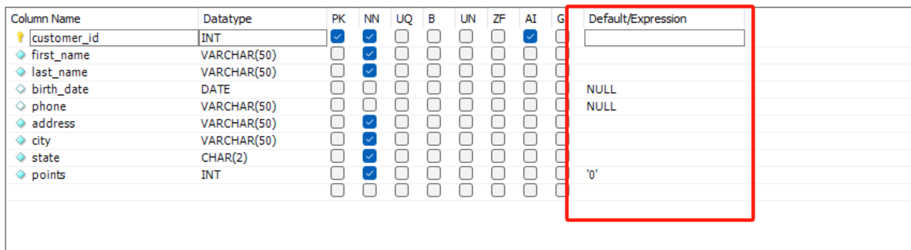
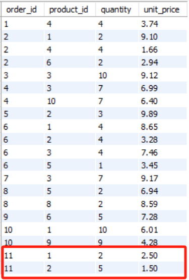

# 一. 基础——增删查改 <!-- omit from toc -->

- [1. 单表检索](#1-单表检索)
	- [1.1. SELECT, WHERE, AND, OR, NOT 用法](#11-select-where-and-or-not-用法)
	- [1.2. IN, BETWEEN 运算符](#12-in-between-运算符)
	- [1.3. LIKE 运算符](#13-like-运算符)
	- [1.4. REGEXP 运算符 (Regular Expression 正则表达式）](#14-regexp-运算符-regular-expression-正则表达式)
	- [1.5. IS NULL, ORDER BY, LIMIT 运算符](#15-is-null-order-by-limit-运算符)
- [2. 多表检索](#2-多表检索)
	- [2.1. INNER JOIN 内连接](#21-inner-join-内连接)
	- [2.2. SELF JOIN 自连接](#22-self-join-自连接)
	- [2.3. Compound JOIN 复合连接条件](#23-compound-join-复合连接条件)
	- [2.4. Outer JOIN 外连接](#24-outer-join-外连接)
	- [2.5. NATURAL JOIN 自然连接](#25-natural-join-自然连接)
	- [2.6. CROSS JOIN 交叉连接](#26-cross-join-交叉连接)
	- [2.7. UNION 联合](#27-union-联合)
- [3. 插入、更新和删除](#3-插入更新和删除)
	- [3.1. INSERT 插入单行](#31-insert-插入单行)
	- [3.2. INSERT 插入多行](#32-insert-插入多行)
	- [3.3. INSERT 插入分级行（Hierarchical Rows）](#33-insert-插入分级行hierarchical-rows)
	- [3.4. CREATE 创建表格](#34-create-创建表格)
	- [3.5. UPDATE 更新单行](#35-update-更新单行)
	- [3.6. UPDATE 更新多行](#36-update-更新多行)
	- [3.7. DELETE 删除行](#37-delete-删除行)


> 此笔记默认 MySQL 语法，偶尔会用并表明 MaxCompute ODPS 语法。


- 有关系型 (relational) 和非关系型 (NoSQL) 两类数据库
- SQL: Structured Query Language，结构化查询语言


# 1. 单表检索

**原数据：**


> sql_store 为一个database，其中存在多张表。

## 1.1. SELECT, WHERE, AND, OR, NOT 用法

```SQL
USE sql_store;

SELECT *
FROM customers
WHERE birth_date > '1990-01-01' OR 
      points > 1000 AND state = 'VA'
-- WHERE NOT (birth_date > '1990-01-01' OR 
--       points > 1000 AND state = 'VA')
```
> AND 优先级高于 OR（无括号情况）

## 1.2. IN, BETWEEN 运算符

```sql
USE sql_store;

select * from products
where quantity_in_stock in (38, 49, 72)
-- where quantity_in_stock between 30 and 80
```
> BETWEEN 为必区间，包含两端点
> 也可用于日期，日期本质也是数值，可比较运算

## 1.3. LIKE 运算符

- 模糊查找，查找具有某种模式的字符串的记录/行
  
```SQL
SELECT *
FROM customers
-- WHERE last_name LIKE 'b%'  -- name start with B
-- WHERE last_name LIKE '%b%'  -- name contain B
WHERE last_name LIKE '_____y'  -- sixth character is y

-- % any number of character
-- _ single character
```
> 本质是 boolean，可用 NOT 取反


## 1.4. REGEXP 运算符 (Regular Expression 正则表达式）

- 在搜索字符串方面更为强大，可搜索更复杂的模板

|符号|意义|
|:---:|:---:|
|^|开头|
|$|结尾|
[abc]|含abc|
|[a-c]|含a到c|
|\||logical or|

```SQL
USE sql_store;

SELECT *
FROM customers

-- contain field:
-- WHERE last_name REGEXP 'field'

-- ^ beginning
-- $ end
-- | or
-- WHERE last_name REGEXP '^field'
-- WHERE last_name REGEXP 'field$'
-- WHERE last_name REGEXP 'field|mac'

-- either end with field, or contain mac or rose:
-- WHERE last_name REGEXP 'field$|mac|rose'

-- before e either have g or i or m:
-- WHERE last_name REGEXP '[gim]e'
-- before e have one of: abcdefgh:
WHERE last_name REGEXP '[a-h]e'
```

## 1.5. IS NULL, ORDER BY, LIMIT 运算符

```SQL
select .. from .. where .. is null

select .. from .. order by colA DESC, colB DESC

select .. from .. limit 3;  -- return only first 3
select .. from .. limit 6, 3;  -- offset 6: return 7th - 9th
```

# 2. 多表检索

## 2.1. INNER JOIN 内连接

**Horizontal concat:**
```SQL
select *
from tblA
inner join tblB  -- where 'inner' is optional
	on tblA.key = tblB.key
inner join tblC  -- multiple join
	on tblA.key = tblC.another_key

-- if they have the same key:
select *
from tblA
inner join tblB  -- where 'inner' is optional
	using (key)

-- Or implicit join:
select *
from tblA aliasA, tblB aliasB
where aliasA.key = aliasB.key
```

## 2.2. SELF JOIN 自连接

```SQL
USE sql_hr;
select 
    e.employee_id,
    e.first_name,
    m.first_name as manager
from employees e
join employees m
    on e.reports_to = m.employee_id
```

## 2.3. Compound JOIN 复合连接条件

```SQL
select *
from tbl1
join tbl2
	on tbl1.col1 = tbl2.col1
	and tbl1.col2 = tbl2.col2
```

## 2.4. Outer JOIN 外连接

- INNER JOIN: intersection, OUTER JOIN: union.
- LEFT JOIN: return all rows in the left table regardless of the condition, fill with null, same for RIGHT JOIN.

```SQL
select *
from tblA
left join tblB
	on tblA.key = tblB.key
```

## 2.5. NATURAL JOIN 自然连接

- Join by all columns with same name。

```SQL
select *
from tblA
natural join tblB
```

## 2.6. CROSS JOIN 交叉连接

- Join all records from tables (all combinations)。

```SQL
select *
from tblA
cross join tblB

-- Or implicit join:
select *
from tblA, tblB  -- without typing where
```

## 2.7. UNION 联合

- vertical concat (explicit)
- 合并的查询结果必须列数相等，否则会报错
- 合并表里的列名由排在 UNION 前面的决定

```SQL
select 
	col1
	'A' AS type  -- add a new column 'type'
from tbl
where col1 > threshold

union

select 
	arbitary_col
	'B' AS type
from tbl
where arbitary_col < threshold
```

> 合并后的第一列会被命名为 col1

# 3. 插入、更新和删除

## 3.1. INSERT 插入单行

```SQL
INSERT INTO 目标表 （目标列，可选，逗号隔开）
VALUES (目标值，逗号隔开)
```

**不标注列名，则插入的值必须按所有字段的顺序完整插入**

```SQL
USE sql_store;

INSERT [INTO] customers -- 目标表
VALUES (
    DEFAULT,
    'Michael',
    'Jackson',
    '1958-08-29',  -- DEFAULT/NULL/'1958-08-29'
    DEFAULT,
    '5225 Figueroa Mountain Rd', 
    'Los Olivos',
    'CA',
    DEFAULT
    );
```

DEFAULT 需指定：



**指明列名，可跳过取默认值的列且可更改顺序**

```SQL
INSERT [INTO] customers (
    address,
    city,
    state,
    last_name
    )
VALUES (
    '5225 Figueroa Mountain Rd',
    'Los Olivos',
    'CA',
    'Jackson'
    )
```

> 未指明列名的插入 DEFAULT


## 3.2. INSERT 插入多行

**VALUES里一行内数据用括号内逗号隔开，而多行数据用括号间逗号隔开**

```SQL
USE sql_store;

INSERT INTO products 
VALUES (DEFAULT, 'product1', 1, 10),
       (DEFAULT, 'product2', 2, 20),
       (DEFAULT, 'product3', 3, 30)
```

对于AI (Auto Incremental 自动递增) 的id字段，MySQL会记住删除的/用过的id，并在此基础上递增：


> 设置了 AI 就不能设置 DEFAULT


**插入另一个表的多行数据**

```SQL
INSERT temp
select * from customers;
```

**>> ODPS 分区表插入数据**

```SQL
INSERT [OVERWRITE] TABLE temp PARTITION(ds)
select 
	* 
	,20231213 AS ds
from customers
where ds=MAX_PT('customers');
```

> - 额外的“TABLE”。
> - OVERWRITE 表示覆盖，常用于整个分区的更新。


## 3.3. INSERT 插入分级行（Hierarchical Rows）

- 订单表（orders表）里的一条记录对应订单项目表（order_items表）里的多条记录，一对多。
- 比如新增一个订单（order），里面包含两个订单项目/两种商品（order_items）。
- 原数据：

**order**


**order_items**


- 需要用内建函数 LAST_INSERT_ID() 获取相关父表记录的自增ID。
- LAST_INSERT_ID()：获取最新的成功的 INSERT 语句 中的自增id，在这个例子中就是父表里新增的 order_id。


```SQL
INSERT INTO orders (customer_id, order_date, status)
VALUES (1, '2019-01-01', 1);

-- 可以先试一下用 SELECT last_insert_id() 看能否成功获取到的最新的 order_id

INSERT INTO order_items  -- 全是必须字段，就不用指定了
VALUES 
    (last_insert_id(), 1, 2, 2.5),
    (last_insert_id(), 2, 5, 1.5)
```

- 结果：
  
**order**


**order_items**



## 3.4. CREATE 创建表格

```SQL
USE sql_store;

CREATE TABLE [IF NOT EXISTS] orders_archived AS
    SELECT * FROM orders  -- 子查询
```

**创建空表**

```SQL
CREATE TABLE temp (
a int,
b int
);
```

## 3.5. UPDATE 更新单行

```SQL
UPDATE invoices
SET 
    payment_total = 100, 
    payment_date = '2019-01-01'
WHERE invoice_id = 3;
```

## 3.6. UPDATE 更新多行

**语法一样，让 WHERE 的条件包含更多记录**

```SQL
UPDATE customers
SET 
    points = points + 50, 
    a=b
WHERE birth_date < '1990-01-01'
```

## 3.7. DELETE 删除行

```SQL
DELETE FROM invoices
WHERE client_id = 3
```

