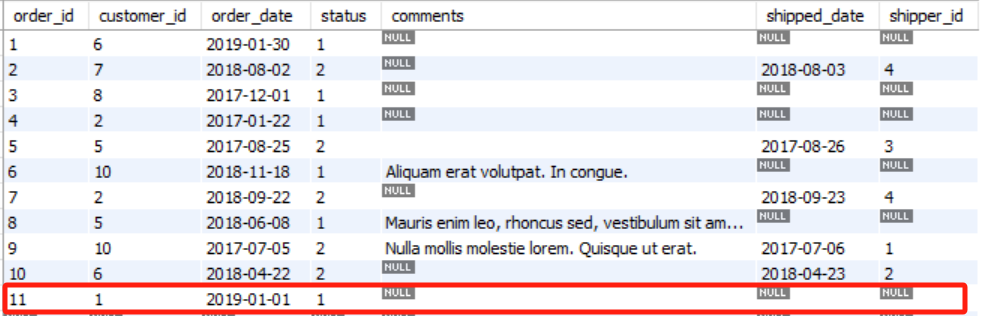

# 四. 插入、更新和删除 - Inserting, Updating and Deleting Data

- [四. 插入、更新和删除 - Inserting, Updating and Deleting Data](#四-插入更新和删除---inserting-updating-and-deleting-data)
  - [4.1. INSERT 插入单行](#41-insert-插入单行)
  - [4.2. INSERT 插入多行](#42-insert-插入多行)
  - [4.3. INSERT 插入分级行（Hierarchical Rows）](#43-insert-插入分级行hierarchical-rows)
  - [4.4. CREATE 创建表格](#44-create-创建表格)
  - [4.5. UPDATE 更新单行](#45-update-更新单行)
  - [4.6. UPDATE 更新多行](#46-update-更新多行)
  - [4.7. DELETE 删除行](#47-delete-删除行)


## 4.1. INSERT 插入单行

```SQL
INSERT INTO 目标表 （目标列，可选，逗号隔开）
VALUES (目标值，逗号隔开)
```

**不标注列名，则插入的值必须按所有字段的顺序完整插入**

```SQL
USE sql_store;

INSERT [INTO] customers -- 目标表
VALUES (
    DEFAULT,
    'Michael',
    'Jackson',
    '1958-08-29',  -- DEFAULT/NULL/'1958-08-29'
    DEFAULT,
    '5225 Figueroa Mountain Rd', 
    'Los Olivos',
    'CA',
    DEFAULT
    );
```

DEFAULT 需指定：


**指明列名，可跳过取默认值的列且可更改顺序**

```SQL
INSERT [INTO] customers (
    address,
    city,
    state,
    last_name
    )
VALUES (
    '5225 Figueroa Mountain Rd',
    'Los Olivos',
    'CA',
    'Jackson'
    )
```

> 未指明列名的插入 DEFAULT


## 4.2. INSERT 插入多行

**VALUES里一行内数据用括号内逗号隔开，而多行数据用括号间逗号隔开**

```SQL
USE sql_store;

INSERT INTO products 
VALUES (DEFAULT, 'product1', 1, 10),
       (DEFAULT, 'product2', 2, 20),
       (DEFAULT, 'product3', 3, 30)
```

对于AI (Auto Incremental 自动递增) 的id字段，MySQL会记住删除的/用过的id，并在此基础上递增：


> 设置了 AI 就不能设置 DEFAULT


**插入另一个表的多行数据**

```SQL
INSERT temp
select * from customers;
```

**>> ODPS 分区表插入数据**

```SQL
INSERT [OVERWRITE] TABLE temp PARTITION(ds)
select 
	* 
	,20231213 AS ds
from customers
where ds=MAX_PT('customers');
```

> - 额外的“TABLE”。
> - OVERWRITE 表示覆盖，常用于整个分区的更新。


## 4.3. INSERT 插入分级行（Hierarchical Rows）

- 订单表（orders表）里的一条记录对应订单项目表（order_items表）里的多条记录，一对多。
- 比如新增一个订单（order），里面包含两个订单项目/两种商品（order_items）。
- 原数据：

**order**


**order_items**


- 需要用内建函数 LAST_INSERT_ID() 获取相关父表记录的自增ID。
- LAST_INSERT_ID()：获取最新的成功的 INSERT 语句 中的自增id，在这个例子中就是父表里新增的 order_id。


```SQL
INSERT INTO orders (customer_id, order_date, status)
VALUES (1, '2019-01-01', 1);

-- 可以先试一下用 SELECT last_insert_id() 看能否成功获取到的最新的 order_id

INSERT INTO order_items  -- 全是必须字段，就不用指定了
VALUES 
    (last_insert_id(), 1, 2, 2.5),
    (last_insert_id(), 2, 5, 1.5)
```

- 结果：
  
**order**



**order_items**


## 4.4. CREATE 创建表格

```SQL
USE sql_store;

CREATE TABLE [IF NOT EXISTS] orders_archived AS
    SELECT * FROM orders  -- 子查询
```

**创建空表**

```SQL
CREATE TABLE temp (
a int,
b int
);
```

## 4.5. UPDATE 更新单行

```SQL
UPDATE invoices
SET 
    payment_total = 100, 
    payment_date = '2019-01-01'
WHERE invoice_id = 3;
```

## 4.6. UPDATE 更新多行

**语法一样，让 WHERE 的条件包含更多记录**

```SQL
UPDATE customers
SET 
    points = points + 50, 
    a=b
WHERE birth_date < '1990-01-01'
```

## 4.7. DELETE 删除行

```SQL
DELETE FROM invoices
WHERE client_id = 3
```

