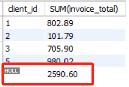

# 五. 汇总数据 - Summarizing Data

- [五. 汇总数据 - Summarizing Data](#五-汇总数据---summarizing-data)
  - [5.1. 聚合函数 Aggregation Functions](#51-聚合函数-aggregation-functions)
  - [5.2. GROUP BY 子句](#52-group-by-子句)
  - [5.3. HAVING 子句](#53-having-子句)
  - [5.4. ROLLUP 运算符](#54-rollup-运算符)
  - [5.5. \*\* SQL 执行顺序](#55--sql-执行顺序)


## 5.1. 聚合函数 Aggregation Functions

```SQL
USE sql_invoicing;

SELECT 
    MAX(invoice_date) AS latest_date,  
    -- SELECT选择的不仅可以是列，也可以是数字、列间表达式、列的聚合函数
    MIN(invoice_total) lowest,
    AVG(invoice_total) average,
    SUM(invoice_total * 1.1) total,
    COUNT(*) total_records,
    COUNT(invoice_total) number_of_invoices, 
    -- 和上一个相等
    COUNT(payment_date) number_of_payments,  
    -- 【聚合函数会忽略空值】，得到的支付数少于发票数
    COUNT(DISTINCT client_id) number_of_distinct_clients
    -- DISTINCT client_id 筛掉了该列的重复值，再COUNT计数，会得到不同顾客数
FROM invoices
WHERE invoice_date > '2019-07-01'  -- 想只统计下半年的结果
```

## 5.2. GROUP BY 子句

```SQL
SELECT 
    client_id,  
    SUM(invoice_total) AS total_sales
FROM invoices
WHERE invoice_date >= '2019-07-01'  -- 筛选，过滤器
GROUP BY client_id  -- 分组
ORDER BY invoice_total DESC
```

## 5.3. HAVING 子句

- HAVING 和 WHERE 都是是条件筛选语句，条件的写法相通。
- WHERE 是对原表中的列进行事前筛选，所以WHERE可以对没选择的列进行筛选，但必须用原表列名而不能用SELECT中的别名
- HAVING 对 SELECT 查询后（通常是分组并聚合查询后）的结果列进行事后筛选，筛选选用聚合条件，该聚合条件可以不在 SELECT 中体现。
  - MySQL 允许使用 SELECT 中使用过的聚合条件的别名用为 HAVING 筛选（看下一章的SQL执行顺序）。

**WHERE 例子：**


```SQL
SELECT 
    client_id,
    SUM(invoice_total) AS total_sales,
    COUNT(*) AS number_of_invoices
FROM invoices
GROUP BY client_id
WHERE invoice_total > 10
```

> 展示所有invoice_total大于10的SUM

**HAVING 例子：**

```SQL
SELECT 
    client_id,
    SUM(invoice_total) AS total_sales,
    COUNT(*) AS number_of_invoices
FROM invoices
GROUP BY client_id
HAVING SUM(invoice_total) > 500
-- HAVING total_sales > 500
```

> 展示 SUM 大于500的数据

- 当HAVING筛选的是聚合函数时，该聚合函数可以不在SELECT里显性出现。

```SQL
SELECT state
FROM customers
GROUP BY state
HAVING SUM(points) > 3000
```

## 5.4. ROLLUP 运算符

- GROUP BY …… WITH ROLL UP 自动汇总型分组。
- **MySQL**扩展语法，不是SQL标准语法。
- 在 GROUP BY 的基础上，额外加一行汇总：

```SQL
SELECT 
    client_id,
    SUM(invoice_total)
FROM invoices
GROUP BY client_id WITH ROLLUP
```



## 5.5. ** SQL 执行顺序

**标准的 SQL 查询语句的执行顺序：**

1. FROM JOIN 选择和连接本次查询所需的表
2. ON/USING WHERE 按条件筛选行
3. GROUP BY 分组
4. HAVING （事后/分组后）筛选行
5. SELECT 筛选列
6. DISTINCT 去重
7. UNION 纵向合并
8. ORDER BY 排序
9. LIMIT 限制

"SELECT 是在大部分语句执行了之后才执行的，严格的说是在 FROM、WHERE 和 GROUP BY （以及 HAVING）之后执行的。这就是不能在 WHERE 中使用在 SELECT 中设定别名的字段作为判断条件的原因。"

这个顺序可以由下面这个例子的缩进表现出来（出右往左）：

```SQL
                SELECT name, SUM(invoice_total) AS total_sales
         -- DISTINCT
                                FROM invoices JOIN clients USING (client_id) 
                            WHERE due_date < '2019-07-01'
                        GROUP BY name  
                    HAVING total_sales > 150

        UNION

                SELECT name, SUM(invoice_total) AS total_sales
         -- DISTINCT
                                FROM invoices JOIN clients USING (client_id) 
                            WHERE due_date > '2019-07-01'
                        GROUP BY name  
                    HAVING total_sales > 150

    ORDER BY total_sales
LIMIT 2
```

关于SELECT和HAVING的顺序，文献表示 HAVING 在 SELECT 前，但尚未找到 HAVING 中使用 SELECT 里定义的别名也可以运行的明确解释。如下代码注释部分：

```SQL
SELECT 
    client_id,
    SUM(invoice_total) AS total_sales,
    COUNT(*) AS number_of_invoices
FROM invoices
GROUP BY client_id
HAVING SUM(invoice_total) > 500
-- HAVING total_sales > 500
```

目前 MySQL 和 MaxCompute SQL 中此用法均可行。但貌似其他大部分 SQL 中非法。暂时理解成标准 SQL 非法，前两者做了兼容（如中间生成虚拟表）。
