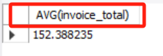

# 六. 复杂查询 - Complex Query

- [六. 复杂查询 - Complex Query](#六-复杂查询---complex-query)
  - [6.1. 子查询 Subqueries vs JOINS](#61-子查询-subqueries-vs-joins)
  - [6.2. ALL 关键字](#62-all-关键字)
  - [6.3. ANY 关键字](#63-any-关键字)
  - [6.4. 相关子查询 Correlated Subqueries](#64-相关子查询-correlated-subqueries)
  - [6.5. EXISTS 运算符](#65-exists-运算符)
  - [6.6. SELECT 子句的子查询](#66-select-子句的子查询)
  - [6.7. FROM 子句的子查询](#67-from-子句的子查询)

## 6.1. 子查询 Subqueries vs JOINS

选出买过生菜（id = 3）的顾客

```SQL
SELECT *
FROM customers
WHERE customer_id IN (
    SELECT DISTINCT customer_id
    FROM orders
    WHERE order_id IN (
        SELECT order_id
        FROM order_items
        WHERE product_id = 3
    )
);
```

等效于：

```SQL
SELECT DISTINCT customers.* 
FROM customers
LEFT JOIN orders 
    USING (customer_id)
LEFT JOIN order_items
    USING (order_id)
WHERE product_id = 3;
```

## 6.2. ALL 关键字

- `(MAX (……))` 和 `> ALL(……)` 等效:

```SQL
SELECT *
FROM invoices
WHERE invoice_total > (
    SELECT MAX(invoice_total)
    FROM invoices
    WHERE client_id = 3
)
```

```SQL
SELECT *
FROM invoices
WHERE invoice_total > ALL (
    SELECT invoice_total
    FROM invoices
    WHERE client_id = 3
)
```

## 6.3. ANY 关键字

- `> ANY/SOME (……)` 和 `> (MIN (……))` 等效:

```SQL
SELECT *
FROM invoices

WHERE invoice_total > ANY (
    SELECT invoice_total
    FROM invoices
    WHERE client_id = 3
)

-- equivalent:

WHERE invoice_total > (
    SELECT MIN(invoice_total)
    FROM invoices
    WHERE client_id = 3
)
```

- `= ANY/SOME (……)` 和 `IN (……)` 等效:


```SQL
SELECT *
FROM clients
WHERE client_id IN (  
-- WHERE client_id = ANY ( 
    -- 有2次以上发票记录的顾客
    SELECT client_id
    FROM invoices
    GROUP BY client_id
    HAVING COUNT(*) >= 2
)
```


## 6.4. 相关子查询 Correlated Subqueries

- 之前都是非关联主/子（外/内）查询，这种子查询与主查询无关，会先一次性得出查询结果再返回给主查询供其使用。
- 而下面这种相关联子查询例子里，子查询是依赖主查询的，注意这种关联查询是在主查询的每一行/每一条记录层面上依次进行的，相关子查询会比非关联查询执行起来**慢**。

找出高于每位顾客平均发票金额的发票：

```SQL
USE sql_invoicing;

SELECT * 
FROM invoices i
WHERE invoice_total > (
    SELECT AVG(invoice_total)
    FROM invoices
    WHERE client_id = i.client_id
    -- 可以理解成对每一个 i.client_id 进行 Implicit JOIN 后的 AVG
);
```

## 6.5. EXISTS 运算符

- `IN + 子查询` 等效于 `EXIST + 相关子查询`。
- 如果前者子查询的结果集过大占用内存，用后者逐条验证**更有效率**。
-  EXIST() 本质上是根据是否为空返回 TRUE 和 FALSE，所以也可以加 NOT 取反。

找出有过发票记录的客户

```SQL
SELECT *
FROM clients
WHERE client_id IN (
    SELECT DISTINCT client_id
    FROM invoices
)
```

等效于

```SQL
SELECT *
FROM clients c
WHERE EXISTS (
    SELECT */client_id  
    /* 就这个子查询的目的来说，SELECT的选择不影响结果，
    因为EXISTS()函数只根据是否为空返回 TRUE 和 FALSE */
    FROM invoices
    WHERE client_id = c.client_id
)
```

> 理解成 client_id = c.client_id 的 boolean array


## 6.6. SELECT 子句的子查询

得到一个有如下列的表格：invoice_id, invoice_total, avarege（总平均发票额）, difference（前两个值的差）：

```SQL
SELECT 
    invoice_id,
    invoice_total,
    (SELECT AVG(invoice_total) FROM invoices) AS invoice_average,  -- 见知识点1
    -- 不能直接用聚合函数，因为“比较强势”，会压缩聚合结果为一条;
    -- 用括号+子查询(SELECT AVG(invoice_total) FROM invoices) 将其作为一个数值结果加入主查询语句
    invoice_total - (SELECT invoice_average) AS difference  -- 见知识点2
    -- SELECT表达式里要用原列名，不能直接用别名invoice_average
FROM invoices
```

- 知识点1：直接用 AVG(invoice_total) AS invoice_average 会报错，因为AVG(invoice_total) 是一个聚合函数，而在SELECT子句中使用聚合函数时，它会被解释为一个单一的值，而不是一个可以在同一级别直接引用的别名。
- 为了解决这个问题，可以使用子查询将聚合函数的结果作为一个单一的值嵌套在主查询中。
- 尝试单独运行：

```SQL
SELECT AVG(invoice_total) FROM invoices;
```

结果：


- 知识点2：invoice_total - invoice_average AS difference 会报错，在同一级别无法直接引用其他别名。
- 解决方法是使用子查询，将invoice_average 作为一个子查询中的别名，然后在主查询中引用它。


得到一个有如下列的表格：client_id, name, total_sales（各个客户的发票总额）, average（总平均发票额）, difference（前两个值的差）：

```SQL
SELECT 
    client_id,
    name,
    (SELECT SUM(invoice_total) FROM invoices i WHERE i.client_id = c.client_id) AS total_sales,
    -- 可以理解成对每一个c.client_id, 进行和invoices 的Implicit JOIN
    (SELECT AVG(invoice_total) FROM invoices) AS average,
    (SELECT average - total_sales) AS difference
FROM clients c;
```


## 6.7. FROM 子句的子查询

将上一节练习里的查询结果当作来源表，查询其中 total_sales 非空的记录

```SQL
SELECT * 
FROM (
    SELECT 
        client_id,
        name,
        (SELECT SUM(invoice_total) FROM invoices i WHERE i.client_id = c.client_id) AS total_sales,
        -- 可以理解成对每一个c.client_id, 进行和invoices 的Implicit JOIN
        (SELECT AVG(invoice_total) FROM invoices) AS average,
        (SELECT average - total_sales) AS difference
    FROM clients c
) AS sales_summury
WHERE total_sales IS NOT NULL
```

> - 在FROM中使用子查询，即使用 “派生表” 时，必须给派生表取个别名（不管用不用），这是硬性要求，不写会报错：
> - Error Code: 1248. Every derived table（派生表、导出表）must have its own alias
