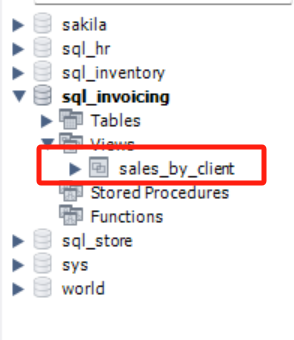
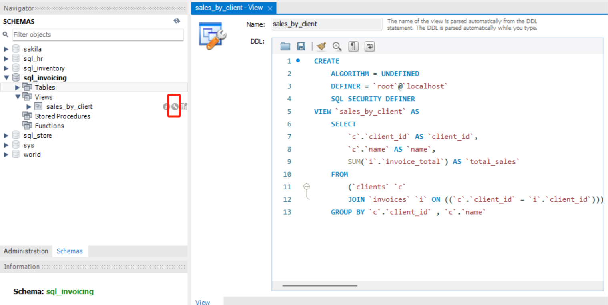

# 八. 视图 - VIEW

- [八. 视图 - VIEW](#八-视图---view)
  - [8.1. 创建视图](#81-创建视图)
  - [8.2. 更新或删除视图](#82-更新或删除视图)
  - [8.3. 可更新视图 Updating Views](#83-可更新视图-updating-views)
    - [8.3.1. 删除 DELETE](#831-删除-delete)
    - [8.3.2. 改 UPDATE](#832-改-update)
    - [8.3.3. 增 INSERT](#833-增-insert)
  - [8.4. WITH CHECK OPTION 子句](#84-with-check-option-子句)
  - [8.5. 视图的其他优点](#85-视图的其他优点)

## 8.1. 创建视图

创建虚拟表

```SQL
CREATE VIEW sales_by_client AS
    SELECT 
        client_id,
        name,
        SUM(invoice_total) AS total_sales
    FROM clients c
    JOIN invoices i USING(client_id)
    GROUP BY client_id, name;
```



之后可以直接在 SQL 中使用 `SELECT * FROM sales_by_client`

等效于 WITH：

```SQL
WITH (
    SELECT 
        client_id,
        name,
        SUM(invoice_total) AS total_sales
    FROM clients c
    JOIN invoices i USING(client_id)
    GROUP BY client_id, name
) AS sales_by_client
SELECT * FROM sales_by_client
```

区别：
- 前者创建的是虚拟表，可以在不同 query 中使用。
- 后者创建的是临时表，只能在同一个 query 中使用。

删除视图：


```SQL
DROP VIEW sales_by_client
```


## 8.2. 更新或删除视图

方法1 - 先删除再重建：

```SQL
DROP VIEW IF EXISTS clients_balance;

CREATE VIEW clients_balance AS 
    ……
```

方法2 - 用 REPLACE：

```SQL
CREATE OR REPLACE VIEW clients_balance AS
    ……
```

> 如没有对应视图则直接创建。

若丢失了原始查询语句，要查看的话可点击视图的扳手按钮打开编辑模式，可看到如下被MySQL处理了的查询语句：




## 8.3. 可更新视图 Updating Views

如果一个视图的原始查询语句中没有如下元素：
1. DISTINCT 去重
2. GROUP BY/HAVING/聚合函数 (后两个通常是伴随着 GROUP BY 分组出现的)
3. UNION 纵向连接

则该视图是可更新视图（Updatable Views），可以增删改，否则只能查（涉及到安全和权限的内容）。

**注意**：修改视图的数据也会更新原表，即使两者数据不一样。

创建视图（新虚拟表）invoices_with_balance（带差额的发票记录表）：

```SQL
CREATE OR REPLACE VIEW invoices_with_balance AS
SELECT 
    /* 这里有个小技巧，要插入表中的多列列名时，
    可从左侧栏中连选并拖入相关列 */
    invoice_id, 
    number, 
    client_id, 
    invoice_total, 
    payment_total, 
    invoice_date,
    invoice_total - payment_total AS balance,  -- 新增列
    due_date, 
    payment_date
FROM invoices
WHERE (invoice_total - payment_total) > 0
```

### 8.3.1. 删除 DELETE

删掉id为1的发票记录

```SQL
DELETE FROM invoices_with_balance
WHERE invoice_id = 1
```

> 会从视图和原表中同时删除 invoice_id = 1 的记录。

### 8.3.2. 改 UPDATE

将2号发票记录的期限延后两天

```SQL
UPDATE invoices_with_balance
SET due_date = DATE_ADD(due_date, INTERVAL 2 DAY)
WHERE invoice_id = 2
```

### 8.3.3. 增 INSERT

**新增记录有前提**：
- 即视图必须包含其底层所有原始表的所有必须字段。
- 因为会同时改变视图和原表，如原表中没有对应字段，则也无法往视图中新增。


## 8.4. WITH CHECK OPTION 子句

- WITH CHECK OPTION 可以防止一些会让原始图中某行消失的语句。


接前面的 invoices_with_balance 视图的例子，该视图与原始的 orders 表相比增加了balance(invouce_total - payment_total) 列，且只显示 balance 大于0的行（记录），若将某记录（如2号订单）的 payment_total 改为和 invouce_total 相等，则 balance 为0，不满足条件，该记录会从视图中消失：

```SQL
UPDATE invoices_with_balance
SET payment_total = invoice_total
WHERE invoice_id = 2
```

为防止这种情况，可以在创建视图时加上 `WITH CHECK OPTION`：

```SQL
CREATE OR REPLACE VIEW invoices_with_balance AS
SELECT 
    /* 这里有个小技巧，要插入表中的多列列名时，
    可从左侧栏中连选并拖入相关列 */
    invoice_id, 
    number, 
    client_id, 
    invoice_total, 
    payment_total, 
    invoice_date,
    invoice_total - payment_total AS balance,  -- 新增列
    due_date, 
    payment_date
FROM invoices
WHERE (invoice_total - payment_total) > 0
WITH CHECK OPTION
```

此时再运行上面的 UPDATE 语句，将会报错。


## 8.5. 视图的其他优点

1. **简化查询 simplify queries**
2. **增加抽象层，减少变化的影响 Reduce the impact of changes**：视图给表增加了一个抽象层（模块化），这样如果数据库设计改变了，只需修改视图的查询语句使其能保持原有查询结果即可，不需要修改使用这个视图的那几十个查询。
   - 比如当原表某个字段名变了，可以直接在视图上加上 `SELECT new_name AS old_name, ...`，这些使用这个视图的其他查询还可以继续使用 `old_name`。
3. **限制对原数据的访问权限 Restrict access to the data**：如果只想让用户查看或修改部分数据，创建视图时可以只 SELECT 部分列，或者加上 filter，如`(WHERE time < '2023-01-01)`，这样用户无法查看或修改新数据。