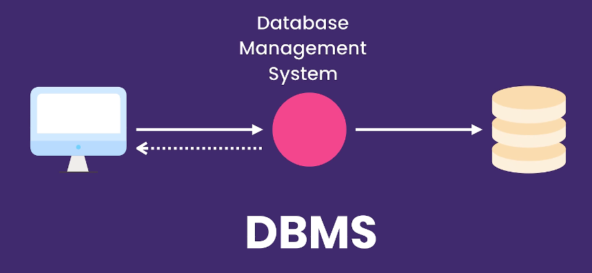
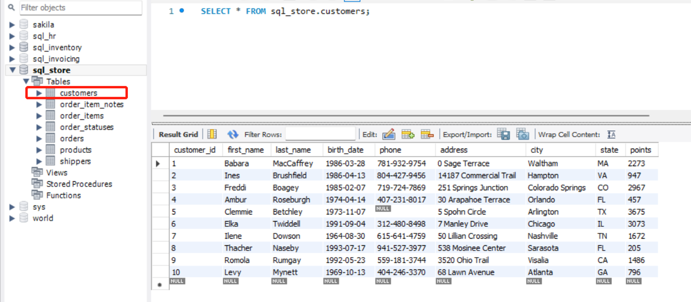

# 一. 基础——增删查改 <!-- omit from toc -->



- 有关系型 (relational) 和非关系型 (NoSQL) 两类数据库
- SQL: Structured Query Language，结构化查询语言


# 1. 单表检索

**原数据：**



> sql_store 为一个database，其中存在多张表。

## SELECT, WHERE, AND, OR, NOT 用法

```SQL
USE sql_store;

SELECT *
FROM customers
WHERE birth_date > '1990-01-01' OR 
      points > 1000 AND state = 'VA'
-- WHERE NOT (birth_date > '1990-01-01' OR 
--       points > 1000 AND state = 'VA')
```
> AND 优先级高于 OR（无括号情况）

## IN, BETWEEN 运算符

```sql
USE sql_store;

select * from products
where quantity_in_stock in (38, 49, 72)
-- where quantity_in_stock between 30 and 80
```
> BETWEEN 为必区间，包含两端点
> 也可用于日期，日期本质也是数值，可比较运算

## LIKE 运算符

- 模糊查找，查找具有某种模式的字符串的记录/行
  
```SQL
SELECT *
FROM customers
-- WHERE last_name LIKE 'b%'  -- name start with B
-- WHERE last_name LIKE '%b%'  -- name contain B
WHERE last_name LIKE '_____y'  -- sixth character is y

-- % any number of character
-- _ single character
```
> 本质是 boolean，可用 NOT 取反


## REGEXP 运算符 (Regular Expression 正则表达式）

- 在搜索字符串方面更为强大，可搜索更复杂的模板

|符号|意义|
|:---:|:---:|
|^|开头|
|$|结尾|
[abc]|含abc|
|[a-c]|含a到c|
|\||logical or|

```SQL
USE sql_store;

SELECT *
FROM customers

-- contain field:
-- WHERE last_name REGEXP 'field'

-- ^ beginning
-- $ end
-- | or
-- WHERE last_name REGEXP '^field'
-- WHERE last_name REGEXP 'field$'
-- WHERE last_name REGEXP 'field|mac'

-- either end with field, or contain mac or rose:
-- WHERE last_name REGEXP 'field$|mac|rose'

-- before e either have g or i or m:
-- WHERE last_name REGEXP '[gim]e'
-- before e have one of: abcdefgh:
WHERE last_name REGEXP '[a-h]e'
```

## IS NULL, ORDER BY, LIMIT 运算符

```SQL
select .. from .. where .. is null

select .. from .. order by colA DESC, colB DESC

select .. from .. limit 3;  -- return only first 3
select .. from .. limit 6, 3;  -- offset 6: return 7th - 9th
```

# 多表检索

## INNER JOIN 内连接

**Horizontal concat:**
```SQL
select *
from tblA
inner join tblB  -- where 'inner' is optional
	on tblA.key = tblB.key
inner join tblC  -- multiple join
	on tblA.key = tblC.another_key

-- if they have the same key:
select *
from tblA
inner join tblB  -- where 'inner' is optional
	using (key)

-- Or implicit join:
select *
from tblA aliasA, tblB aliasB
where aliasA.key = aliasB.key
```

## SELF JOIN 自连接

```SQL
USE sql_hr;
select 
    e.employee_id,
    e.first_name,
    m.first_name as manager
from employees e
join employees m
    on e.reports_to = m.employee_id
```

## Compound JOIN 复合连接条件

```SQL
select *
from tbl1
join tbl2
	on tbl1.col1 = tbl2.col1
	and tbl1.col2 = tbl2.col2
```

## Outer JOIN 外连接

- INNER JOIN: intersection, OUTER JOIN: union.
- LEFT JOIN: return all rows in the left table regardless of the condition, fill with null, same for RIGHT JOIN.

```SQL
select *
from tblA
left join tblB
	on tblA.key = tblB.key
```

## NATURAL JOIN 自然连接

- Join by all columns with same name。

```SQL
select *
from tblA
natural join tblB
```

## CROSS JOIN 交叉连接

- Join all records from tables (all combinations)。

```SQL
select *
from tblA
cross join tblB

-- Or implicit join:
select *
from tblA, tblB  -- without typing where
```

## UNION 联合

- vertical concat (explicit)
- 合并的查询结果必须列数相等，否则会报错
- 合并表里的列名由排在 UNION 前面的决定

```SQL
select 
	col1
	'A' AS type  -- add a new column 'type'
from tbl
where col1 > threshold

union

select 
	arbitary_col
	'B' AS type
from tbl
where arbitary_col < threshold
```

> 合并后的第一列会被命名为 col1

# 插入、更新和删除