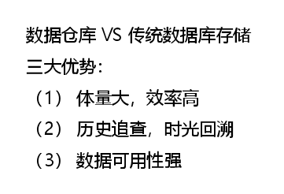
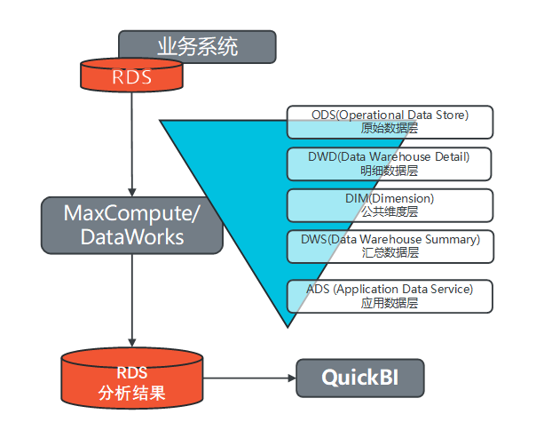
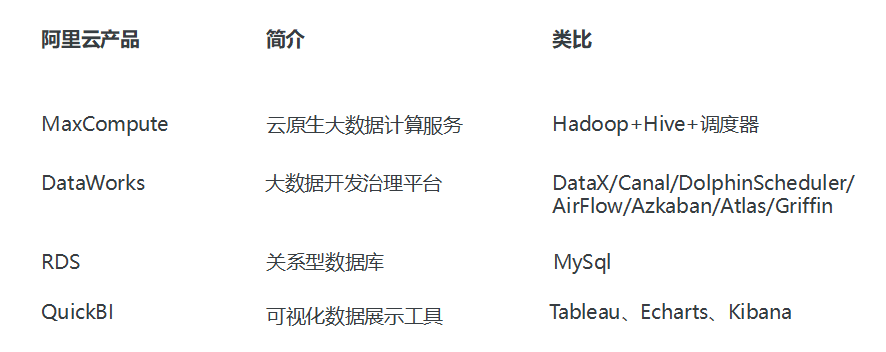
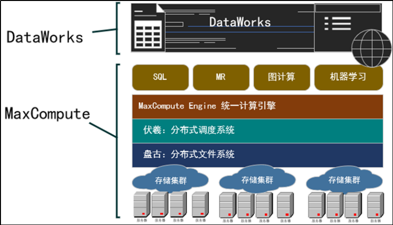
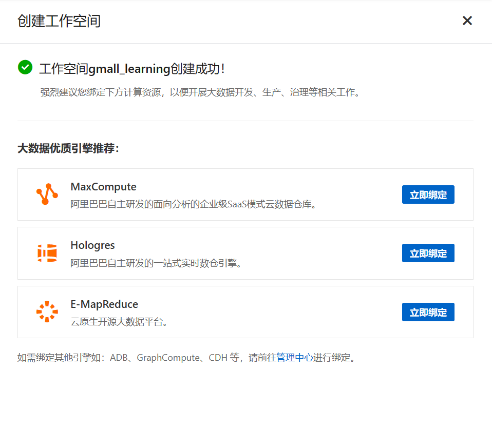

# 基于阿里云 DataWorks & MaxCompute 搭建离线数据仓库  <!-- omit from toc -->

> 笔记整理自：尚硅谷大数据MaxCompute教程（阿里云离线数仓项目）

- [1. 目标](#1-目标)
- [2. 数据仓库概念](#2-数据仓库概念)
- [3. 项目需求](#3-项目需求)
- [4. 技术选型](#4-技术选型)
- [5. DataWorks \& MaxCompute](#5-dataworks--maxcompute)

# 1. 目标
- 学习搭建数据仓库，理解数据在整个数仓架构的从采集、存储、计算、输出、展示的整个业务流程。
- 全面基于阿里云技术框架，学习各个服务组件。

# 2. 数据仓库概念

- 数据仓库（Data Warehouse）是为企业所有决策制定过程，提供所有系统数据支持的战略集合。
 

**数仓常见数据来源**：
1. 日志采集系统：一般用 json 格式储存
2. 业务系统数据库：表格数据，如 MySQL
3. 爬虫系统等：网页数据，数据量一般较少

**数仓分层**：
- ODS：原封不动，映射
- DWD：事实表
- DIM：维度表
- DWS：数据初步聚合
- ADS：应用

# 3. 项目需求

1. 采集业务数据库中数据，数据源 RDS
2. 数据仓库搭建
   1. 模型
   2. 结构搭建工具：Dataworks，不用hive、hadoop等开源框架
3. 针对 ADS（数据应用层）分析统计业务指标，得到业务指标，给到数据需求方
4. 使用 QuickBI 对结果进行可视化展示

# 4. 技术选型

# 5. DataWorks & MaxCompute

- **DataWorks**：总的数据治理平台
  - 基于阿里云MaxCompute/Hologres/EMR/CDP等大数据引擎，为数据仓库/数据湖/湖仓一体等解决方案提供统一的全链路大数据开发治理平台。
- **MaxCompute**：引擎
  - 面向分析的企业级 SaaS 模式云数据仓库，以 Serverless 架构提供快速、全托管的在线数据仓库服务，消除了传统数据平台在资源扩展性和弹性方面的限制，最小化用户运维投入。
  - MaxCompute 以前的名字叫 ODPS，所以里面的表格就默认叫 ODPS 表了。

> 在 Dataworks 中创建了实例之后可以选择使用哪个引擎，此项目选用 MaxCompute：
> 
