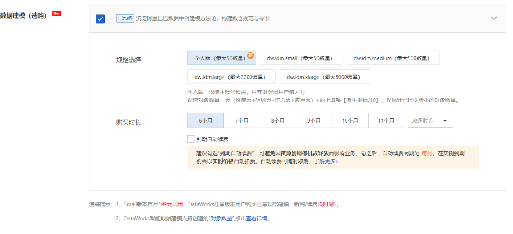
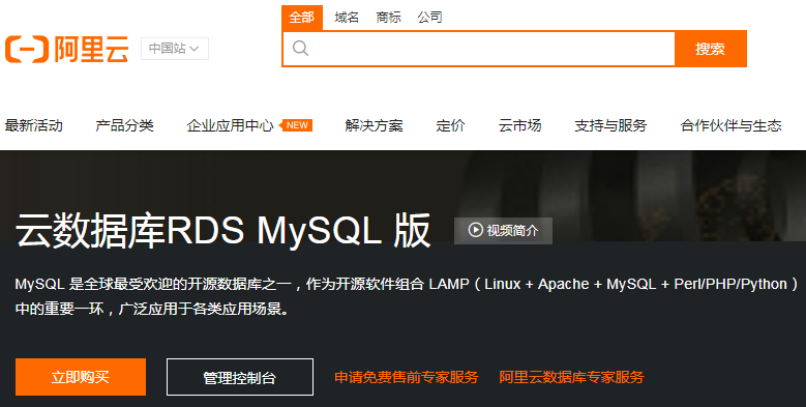
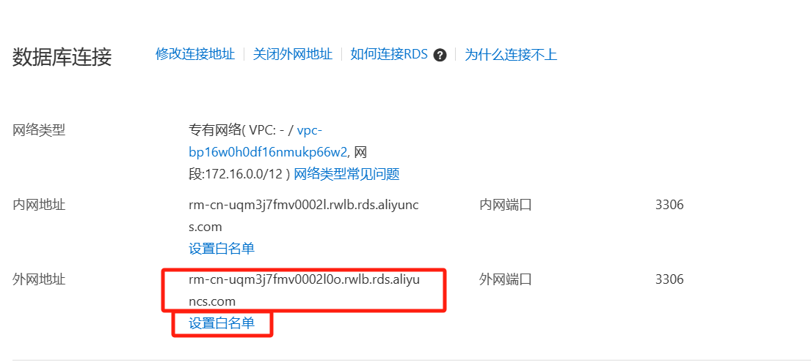

# 二. 项目准备 - 云产品购买及配置 <!-- omit from toc -->

- [1. DataWorks](#1-dataworks)
  - [1.1. 购买](#11-购买)
  - [1.2. 创建工作空间](#12-创建工作空间)
- [2. MaxCompute](#2-maxcompute)
  - [2.1. 购买](#21-购买)
  - [2.2. 添加引擎](#22-添加引擎)
- [3. RDS](#3-rds)
  - [3.1. 购买](#31-购买)
  - [3.2. RDS 服务器配置](#32-rds-服务器配置)
  - [3.3. RDS 服务器连接](#33-rds-服务器连接)

# 1. DataWorks

## 1.1. 购买

> 地域选离的近的

> - 这里好像是唯一需要立刻付款的（60块），其他都是按量付费（轻量级项目、便宜）。
> - 按量付费是扣的余额，但现在可以不用充，去用户中心启用延停服务，欠费到了一定额度再充。

## 1.2. 创建工作空间

进入阿里云官网的 Dataworks 工作台，入口：
   

创建工作空间

> 业务场景下肯定要生产开发环境隔离，这里无所谓。

# 2. MaxCompute

## 2.1. 购买

> 找不到的话直接去第二步添加引擎，应该会跳转购买

## 2.2. 添加引擎

**进去到 Dataworks 页面：**
1. 进入阿里云官网的 Dataworks 工作台
2. 随便点一个
   

Dataworks 首页长这样：

这里面可以快速跳转到任何 Dataworks 工具：

先点 Dataworks 首页右上角的扳手进到工作空间管理 -> 工作空间 -> 计算引擎信息 -> MaxCompute -> 添加引擎 -> done。

# 3. RDS

阿里云关系型数据库（Relational Database Service，简称RDS）是一种稳定可靠、可弹性伸缩的在线数据库服务。

## 3.1. 购买

怎么便宜怎么买，资源选丐版（新用户有免费试用）。

## 3.2. RDS 服务器配置

- 服务建立好以后，首先要建立连接通道，可以让用户远程操控RDS服务器。
- 接下来操作是为了让本地能连上 RDS，如果只打算在云上运行（比较笨重）就够了，则可以跳过。
- 默认只能阿里云内网连上数据库，通俗来讲就是只能在云上写 SQL。为了能让本地也能连上，需要开启外网权限。

在 RDS 控制台，点进创建好的实例：

> 这个 000 的，勾了会把数据暴露出去，比较危险，一般企业用户是绝对不能勾的，练习无所谓。（如果后续连不上本地，就回来把它勾上吧。。。）

接下来点配置白名单：

> 这个外网地址复制着，一会儿连接的时候用。

添加白名单，把自己的 IP 地址填上去：

去创建一个账号：

## 3.3. RDS 服务器连接

本地下载 MySQL，然后 connect，hostname 填刚刚复制的外网地址：

