# 三. 数仓智能建模工具 <!-- omit from toc -->

- [1. 整体流程](#1-整体流程)
- [2. 业务分类](#2-业务分类)
- [3. 数仓分层](#3-数仓分层)
  - [3.1. DIM 明细层检查器](#31-dim-明细层检查器)
  - [3.2. DWD 明细层检查器](#32-dwd-明细层检查器)
  - [3.3. DWS 汇总层检查器](#33-dws-汇总层检查器)
  - [3.4. ADS 应用层检查器](#34-ads-应用层检查器)
- [4. 定义数据域](#4-定义数据域)
- [5. 定义业务过程](#5-定义业务过程)

# 1. 整体流程

1. 业务分类
2. 数仓分层
3. 定义数据域
4. 定义业务过程
5. 创建维度层
   - 定义维度、维度表
6. 创建明细层
   - 定义明细层表
7. 创建汇总层
   - 包括定义原子指标、派生指标、定义汇总层数据表
8. 创建应用层
   - 包括创建数据集市、主题域、定义应用层数据表

# 2. 业务分类

从 DataWorks 主页进到 数据建模 -> 数仓规划，添加业务分类：

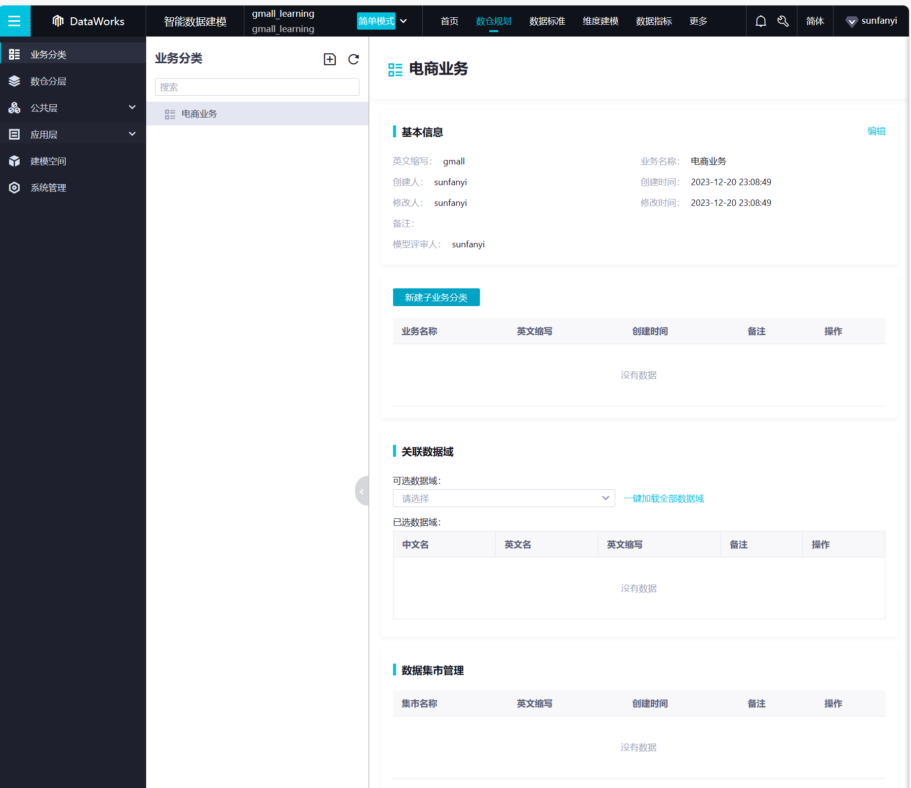

# 3. 数仓分层

系统内置的数仓分层基本与本项目规划的分层一致，可以保持不做修改

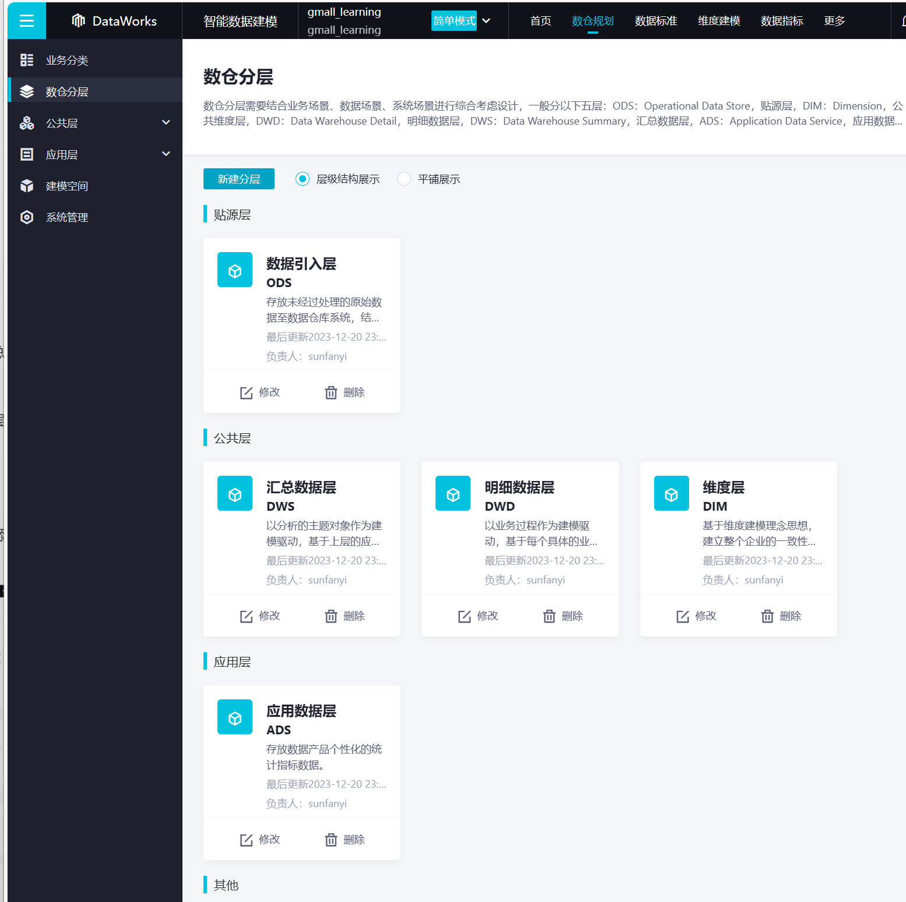

接下来对各层添加维度层检查器（ODS先不管），也就是设置表和指标的命名规范。

## 3.1. DIM 明细层检查器

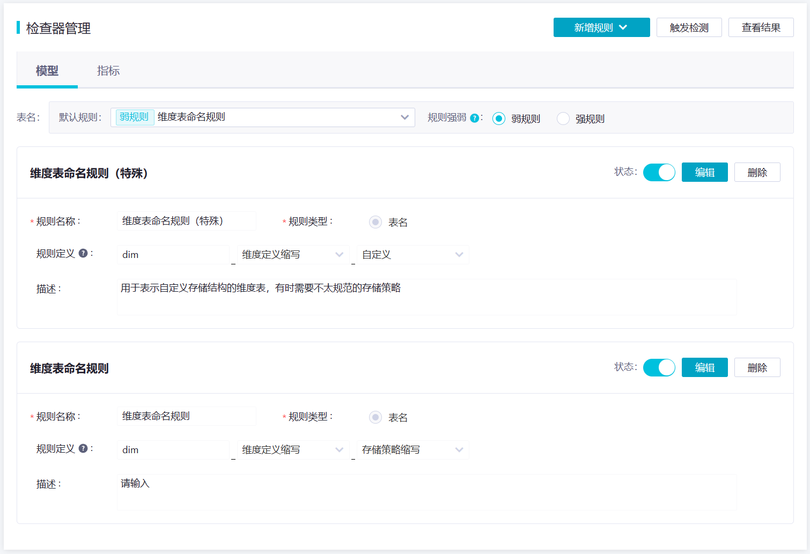

## 3.2. DWD 明细层检查器

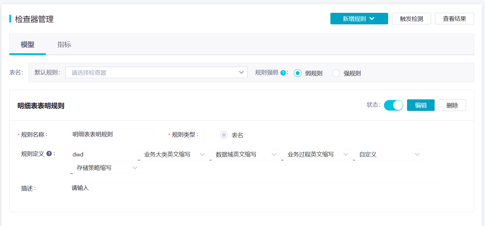

## 3.3. DWS 汇总层检查器

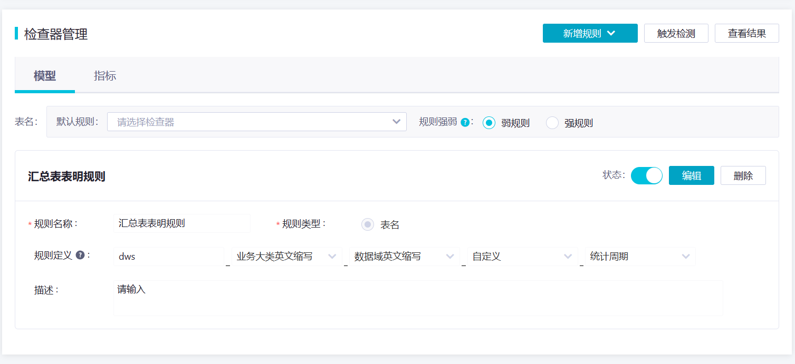

派生指标：

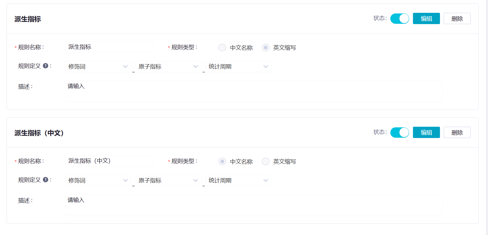

## 3.4. ADS 应用层检查器

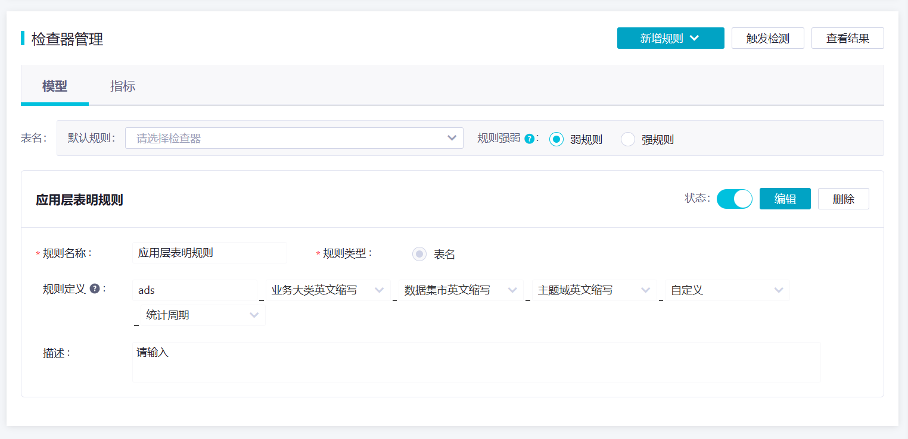

# 4. 定义数据域

- 数据仓库模型设计除横向的分层外，通常也需要根据业务情况进行纵向划分数据域。
- 划分数据域的意义是便于数据的管理和应用。
- 通常可以根据业务过程或者部门进行划分，本项目根据业务过程进行划分，需要注意的是一个业务过程只能属于一个数据域。
- 下面是本项目所有业务过程及数据域划分详情。

数据域	|业务过程
:--|:--
*交易域*	|加购物车、下单、支付、确认收货、退单、退款
*流量域*	|页面浏览、曝光
*用户域*	|注册、登录
*互动域*	|收藏、评价
*工具域*	|优惠券领取、优惠券使用

创建数据域：

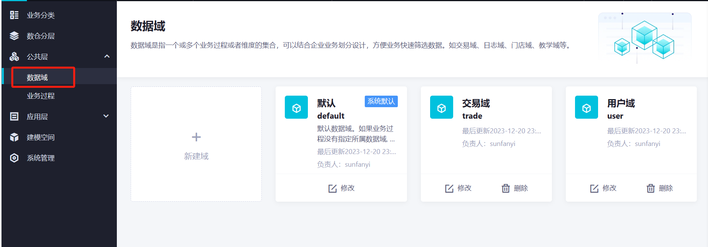

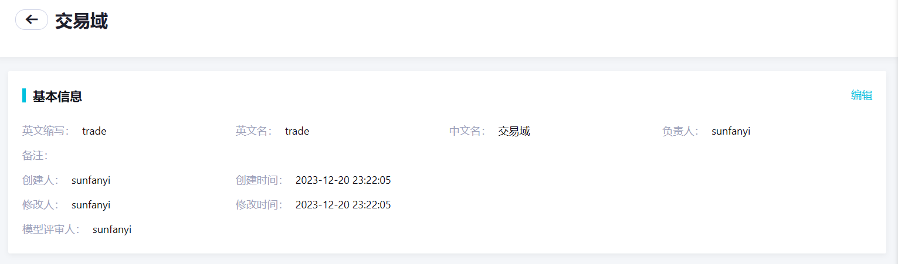

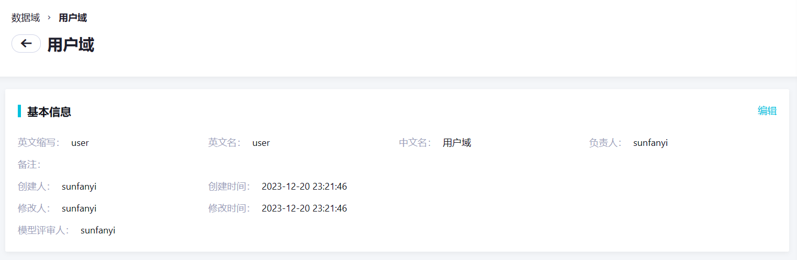

# 5. 定义业务过程

业务过程是和数据域关联的，进入数据域中：

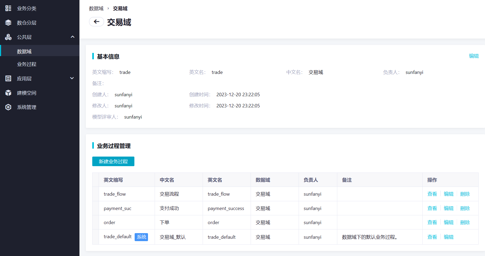

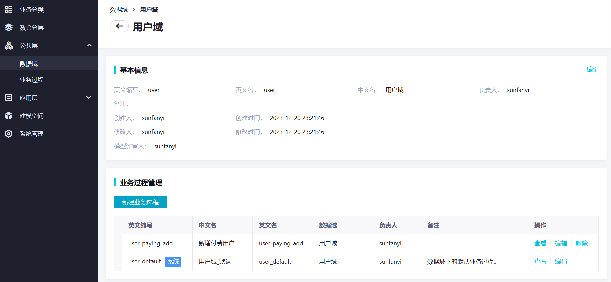