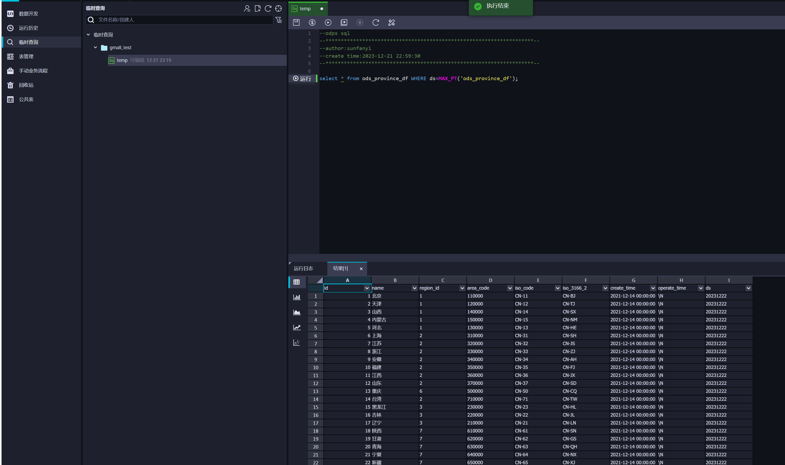
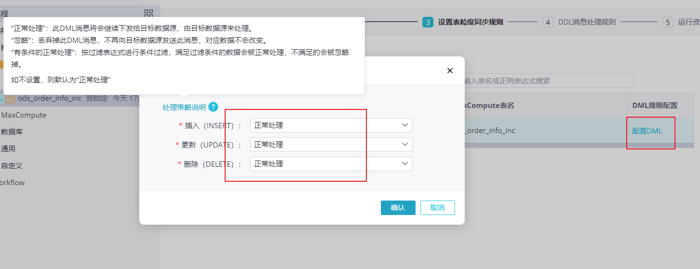

# 四. ODS 层数据同步 <!-- omit from toc -->

**指将表格从 RDS 数据库同步到 ODPS 里，并追踪变更。**


- [1. 业务表结构](#1-业务表结构)
- [2. 同步策略](#2-同步策略)
- [3. 同步策略简写](#3-同步策略简写)
- [4. 全量表同步（离线）](#4-全量表同步离线)
- [5. 增量表同步](#5-增量表同步)
  - [5.1. 增量表实时同步](#51-增量表实时同步)
  - [5.2. 增量表离线同步](#52-增量表离线同步)
    - [5.2.1. 手动初始化](#521-手动初始化)
    - [5.2.2. 自动离线调度](#522-自动离线调度)
- [6. 修改表格属性](#6-修改表格属性)
- [7. 管理业务表格](#7-管理业务表格)
- [8. 业务场景模拟](#8-业务场景模拟)


# 1. 业务表结构


创建数据：去 SQL 里运行 `./mock/gmall0925.sql`

# 2. 同步策略

数据同步策略的类型包括：全量同步、增量同步。

- 全量同步：每天同步完整的数据，也就是每天都会有一张完整的表格。
- 增量同步：每天同步新增加的数据，历史所有数据加在一起才是完整的。


同步策略|	优点|	缺点|
:--|:--|:--
全量同步	|逻辑简单|	在某些情况下效率较低。例如某张表数据量较大，但是每天数据的变化比例很低，若对其采用每日全量同步，则会重复同步和存储大量相同的数据。
增量同步|	效率高，无需同步和存储重复数据|	逻辑复杂，需要将每日的新增及变化数据同原来的数据进行整合，才能使用。

**通常情况，业务表数据量比较大，优先考虑增量，数据量比较小，优先考虑全量。**


**同步方式：**

- 离线同步：周期性运行任务执行同步。
- 实时同步：如字面意思，对资源要求极高。

> 全量表一般只做离线同步，增量表可离线可实时同步。

# 3. 同步策略简写

- 实时同步：ri
- 离线同步：
  - 增量：hi， di， mi
  - 全量：hf， df， mf
  - h， d， m 分别对应小时、天、月。。

# 4. 全量表同步（离线）

**对sku_info，base_province，base_dic三张表格进行天粒度的的离线同步。**

进入 DataStudio，新建一个业务流程，再新建一个离线同步节点：


选择对应数据来源和去向，中间的资源组选公共，独享的特别贵：


选择源表，切分键是在数据量大的时候进行高并发导入用的，可以用默认。在数据去向中新建一张表，分区信息里的 bizdate 表示业务时间，默认是上一天的 YYYYMMDD，ODPS 同步采用 T+1，所以 ds 自然写上一天的日期，比如今天的0点，统计的肯定是昨天的数据：


表名改一下，lifecycle 代表能保留多少天的数据，其他看习惯改（比如分区 pt -> ds）：


字段映射会自动补充，表格小的话并发数1就够，选上不容忍脏数据，也就是出现了数据类型不匹配的数据会报错，因为要相信上游的数据质量：


下一步要配置调度信息，也就是指定它什么时间自动跑。与其等到下一个自动跑的时间不如在这之前先手动让它跑一次：点保存，点带参运行，bizdate 填昨天的日期，等待亿会儿，done。

点右边的调度配置，重跑属性改一下，其他按业务需求改，上游节点现在还没有，一般是要设置根结点的（通过放置虚拟节点），这样冻结了根节点下游就都不会跑了，很方便，否则要一个一个冻结，再细一点可以每种工作放一个上游虚拟节点，再统一归到一个根节点下。

这里先不管：


设置完之后点保存，然后提交，之后每天它就会自动跑了。

相同方法设置好其他两个表：


这样一来就能搜到了：



这里只能一个一个表输入，如果直接数据多个表下面字段会自动关联失败。或者也可以去“数据集成”里实现一次性导入，但要买独享资源组，最便宜的一个月也得500块。

# 5. 增量表同步

- 有两种方法 - 实时同步和离线同步。实时同步可以一次性搞完，但要买独享资源组。。。
- 离线同步会麻烦一点，要手动初始化，还要写 SQL。
- 此项目用离线同步，但也会记录实时同步的方法。


## 5.1. 增量表实时同步

新建一个实时同步节点，选择要同步的 5 张表：


设置表名映射，加前后缀：


点刷新即可创建，然后自动建表：


表粒度同步规则没有特别需求，全部选择正常处理即可：



DDL 处理指上游表发生了变化是该怎么处理，没有特殊需求就直接默认：


选择调度资源组，完成提交。

之后进入运维中心，点启动，done：


## 5.2. 增量表离线同步

### 5.2.1. 手动初始化

去手动业务流程里面新建一个业务流程，完成对应操作，步骤和全量表的离线同步完全一样，区别在于不需要设置调度属性，而是手动带参运行。


### 5.2.2. 自动离线调度

逻辑: 用源表的数据更新目标表，数据存在则更新，数据不存在，则插入：

1. 首先判断目标表是否有源表的数据
2. 如果有，则用源表的数据更新目标表
3. 如果没有，则查询源表的数据，直接插入

这里先假设老数据不会更新，只插入新数据，判断新数据的标准为是否是新创建或者是否有被刚修改过。

同在数据集成中创建离线同步，唯一不同的是这里需要写数据过滤，其余的跟全量表离线同步一样：


> - 这里是看是否为仅一天内新创建的数据。
> - 同步频率是多久这里就写多久，如果每小时一次就改成小时。
> - 如果设置了自动调度，就不要手动去动它了，会出现重复数据。除非先把自动调度停了。


# 6. 修改表格属性

进入表管理，可以看到表格都在“其他”：


点进去一个个设置，设置完点提交到生产环境：


最终：


# 7. 管理业务表格

可以看到这里还没有对应表格：


先创建一个文件夹，然后从引擎关联表格：


# 8. 业务场景模拟

**用脚本往 RDS 里的表格假数据，检查 MaxCompute 是否能顺利更新。**

修改 mock 中的 application 脚本：


连接到阿里云 RDS，地址在 RDS控制台对应实例里面的外网地址（跟第二章那个一样），以及账号密码：


然后把业务日期改到今天：


运行脚本（需要装 JAVA JDK）：

```
java -jar .\gmall-remake-mock-2023-02-17.jar
```


可以看到 RDS 中的新增及修改数据：


此时手动去 DataWorks 里运行一下同步（或者等到时间了自动同步），注意参数里的业务时间改成今天：

