# 五. DIM 层搭建 <!-- omit from toc -->

- [1. 创建维度](#1-创建维度)
- [2. 创建维度表](#2-创建维度表)
  - [2.1. 商品 sku 维度表](#21-商品-sku-维度表)
  - [2.2. 用户信息维度表](#22-用户信息维度表)
  - [2.3. 省份地区维度表](#23-省份地区维度表)
- [3. 同步维度表](#3-同步维度表)
  - [3.1. 商品 sku 维度表](#31-商品-sku-维度表)
  - [3.2. 省份地区维度表](#32-省份地区维度表)
  - [3.3. 用户信息维度表](#33-用户信息维度表)
    - [3.3.1. 拉链表首日装载](#331-拉链表首日装载)
    - [3.3.2. 拉链表每日装载](#332-拉链表每日装载)
- [4. 修改表格属性](#4-修改表格属性)
- [5. 关联业务表格](#5-关联业务表格)


# 1. 创建维度

去维度建模，先创建三个维度：

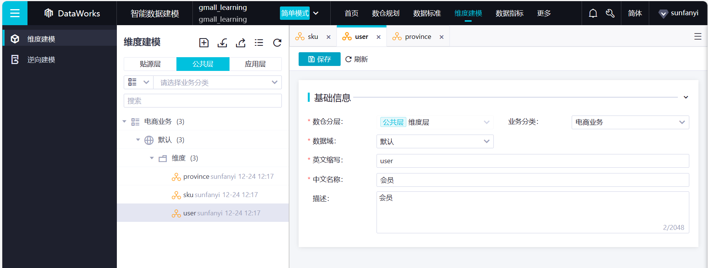


# 2. 创建维度表

接下来创建维度表，维度表不划分数据域，只划分业务过程。

## 2.1. 商品 sku 维度表

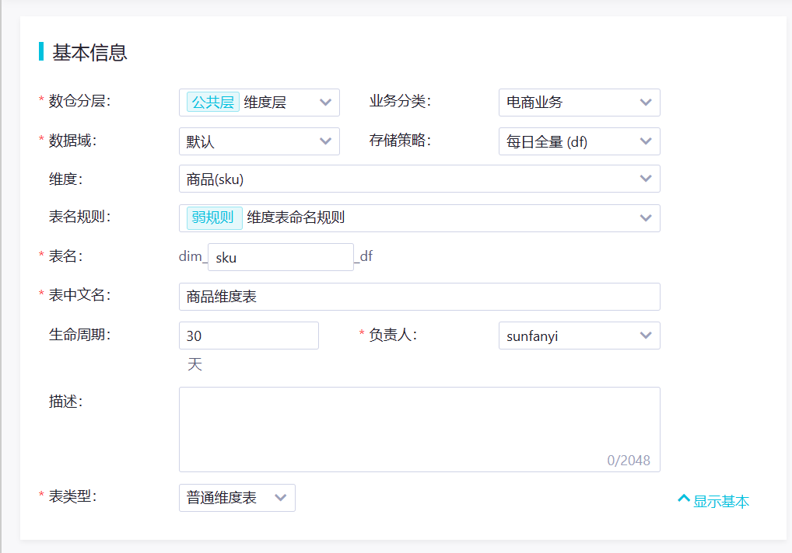

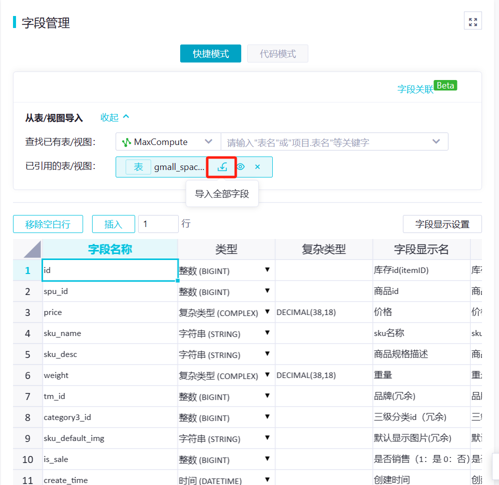

数据类型可以改一下，字符串的话 JOIN 的时候会方便点，主键勾不勾都行，ODPS 对主键没有限制：

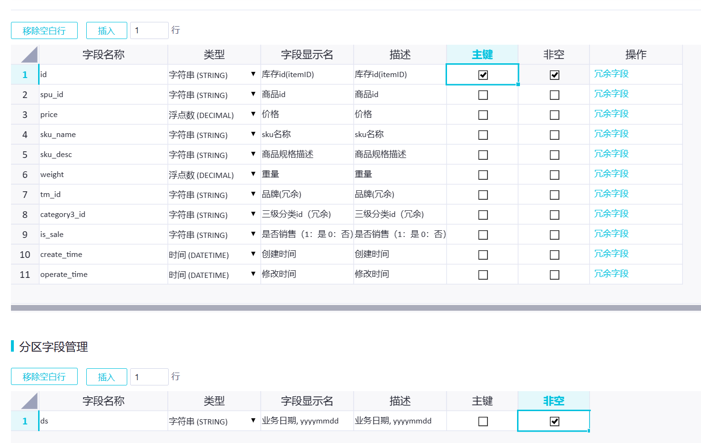

保存 -> 提交 -> 发布，对于初次创表发布模式选哪个都一样。

## 2.2. 用户信息维度表

这张表后期做场拉链表，所以用特殊命名规则；存储策略用增量，选实时或者每日离线都行。周期长一点，防止数据过期：

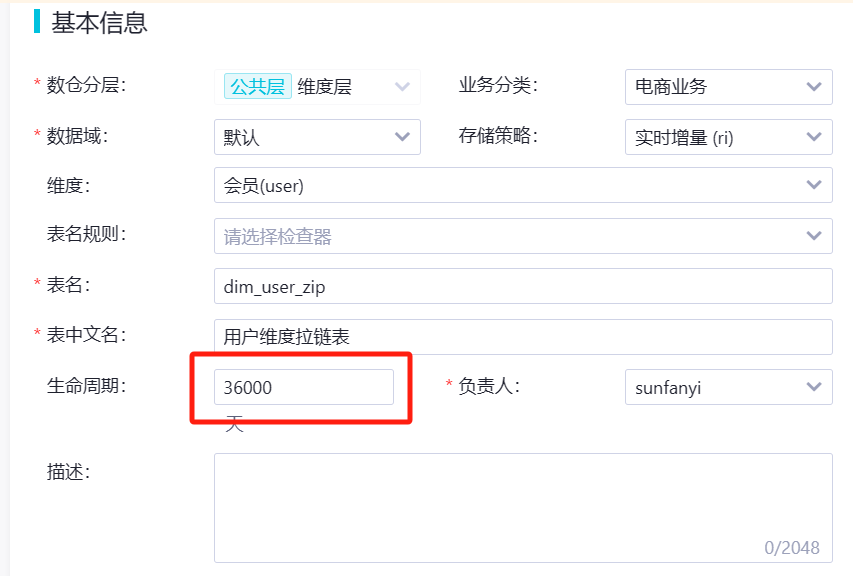

加上开始和结束时间：

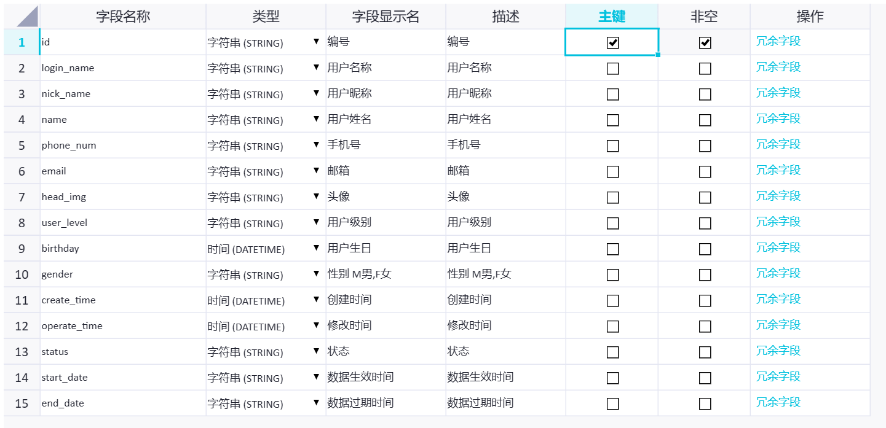

## 2.3. 省份地区维度表

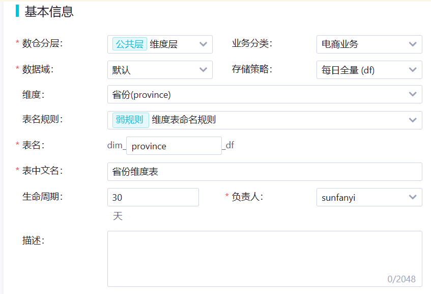

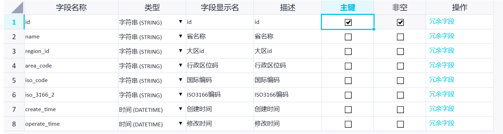

# 3. 同步维度表

读取 ODS 对应表格数据并写入 DIM。
通过定时调度 SQL 实现

## 3.1. 商品 sku 维度表

全量同步：

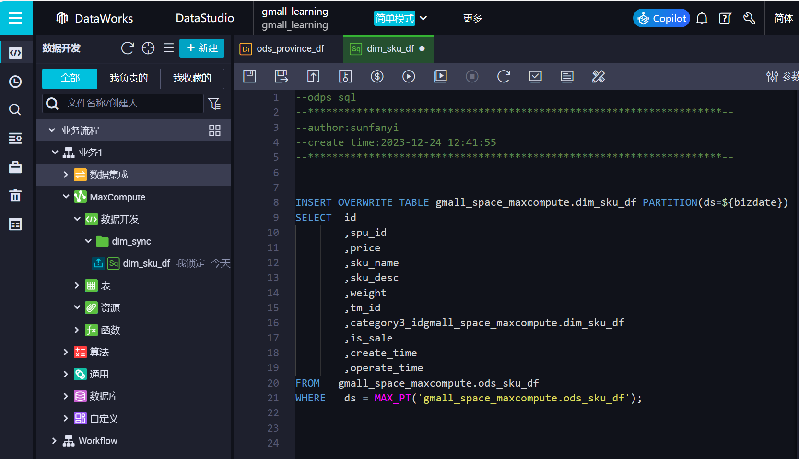

代码：

```SQL
INSERT OVERWRITE TABLE gmall_space_maxcompute.dim_sku_df PARTITION (ds = ${bizdate})
SELECT  id
        ,spu_id
        ,price
        ,sku_name
        ,sku_desc
        ,weight
        ,tm_id
        ,category3_idgmall_space_maxcompute.dim_sku_df
        ,is_sale
        ,create_time
        ,operate_time
FROM    gmall_space_maxcompute.ods_sku_df
WHERE   ds = MAX_PT('gmall_space_maxcompute.ods_sku_df')
;

```

上面是静态分区，或者也可以用动态分区的方式：


```SQL
INSERT OVERWRITE TABLE gmall_space_maxcompute.dim_sku_df PARTITION (ds)
SELECT  id
        ,spu_id
        ,price
        ,sku_name
        ,sku_desc
        ,weight
        ,tm_id
        ,category3_idgmall_space_maxcompute.dim_sku_df
        ,is_sale
        ,create_time
        ,operate_time
        ,${bizdate} ds
FROM    gmall_space_maxcompute.ods_sku_df
WHERE   ds = MAX_PT('gmall_space_maxcompute.ods_sku_df')
;

```

这里的项目空间（gmall_space_maxcompute）不写也没事，因为没做生产开发隔离。真实场景下 gmall_space_maxcompute 对应生产模式；gmall_space_maxcompute_dev 对应开发模式。

记得去给参数赋值：

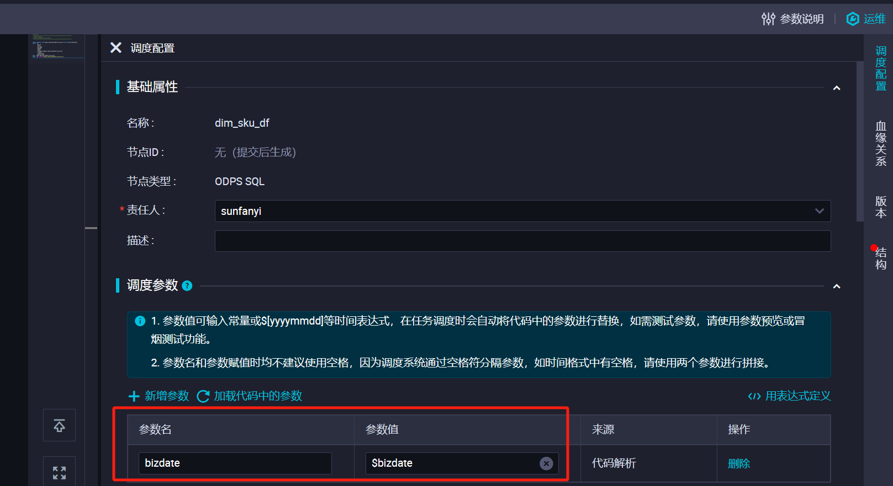


## 3.2. 省份地区维度表

全量同步：

```SQL
INSERT OVERWRITE TABLE gmall_space_maxcompute.dim_province_df PARTITION (ds = ${bizdate})
SELECT  id
        ,name
        ,region_id
        ,area_code
        ,iso_code
        ,iso_3166_2
        ,create_time
        ,operate_time
FROM    gmall_space_maxcompute.ods_province_df
WHERE   ds = MAX_PT('gmall_space_maxcompute.ods_province_df');
```

> 可以看到，全量表同步都很简单。直接拿最近一天的所有数据就行。

## 3.3. 用户信息维度表

增量同步，数据量大，变化少，因此制作为拉链表。

拉链表同步会比较复杂。

### 3.3.1. 拉链表首日装载

先要初始化一张表格，把 ODS 数据复制到 DIM 上。需要规定一个很大的分区值，用来代表最新的有效数据，这样取数的时候直接取这个分区的数据就得到了所有有效数据，而无效数据（被修改过了的）就到了历史分区里，这边定位 `99991231`：

```SQL
SET odps.sql.hive.compatible = true
;

INSERT OVERWRITE TABLE dim_user_zip PARTITION (ds)
SELECT  id
        ,login_name
        ,nick_name
        ,name
        ,phone_num
        ,email
        ,head_img
        ,user_level
        ,birthday
        ,gender
        ,create_time
        ,operate_time
        ,status
        ,DATE_FORMAT(COALESCE(operate_time,create_time),'yyyyMMdd') start_date
        ,'99991231' end_date
        ,'99991231' ds
FROM    ods_user_info_di
WHERE   ds = '20231222';
```

> - 如果用的是实时同步，这里要读取的表格应该是`ods_user_info_di_init`，后续所有的首日装载都是一样的；
> - 这里新增了 start_date 和 end_date，前者代表这条数据上一次被同步的时间，后者代表这条数据失效的时间（即发生了数据变更）。


### 3.3.2. 拉链表每日装载

选择用户信息有两张表：

- ods_user_info_ri：源表，记录了以往变更信息；
- dim_user_zip：目标表，但现在只有首日的数据，没有变更信息，目前里面的end_date 和分区都是 `99991231`，代表有效数据。

步骤：
1. 拿出 DIM 表中的所有`99991231`数据，代表往期有效数据；
2. 拿出 ODS 表中的新数据，分区为 `bizdate`；
3. 两者 UNION。此时会包括所有数据，但有些数据被变更了，所以会出现两条（相同 ID 但信息不一样）；
4. 利用开窗函数 `ROW_NUMBER()`，想象成 groupby id，然后给他们根据 start_date 降序打标，记为 rn；
5. 假如 rn=1（新数据），end_date 和 ds 都设置为 `99991231`，即有效数据；反之则设为`bizdate`，则无效数据。

-> 以后 DIM 表中就不只有 `99991231` 的数据了，但做同步的时候永远只从表里拿这部分的有效数据。

代码：

```SQL

INSERT OVERWRITE TABLE dim_user_zip PARTITION (ds)
SELECT  id
        ,login_name
        ,nick_name
        ,name
        ,phone_num
        ,email
        ,head_img
        ,user_level
        ,birthday
        ,gender
        ,create_time
        ,operate_time
        ,status
        ,start_date
        ,IF(rn = 1,end_date,'${bizdate}') end_date
        ,IF(rn = 1,end_date,'${bizdate}') ds
FROM    (
            SELECT  *
                    ,ROW_NUMBER() OVER (PARTITION BY id ORDER BY start_date DESC ) rn
            FROM    (
                        SELECT  id
                                ,login_name
                                ,nick_name
                                ,name
                                ,phone_num
                                ,email
                                ,head_img
                                ,user_level
                                ,birthday
                                ,gender
                                ,create_time
                                ,operate_time
                                ,status
                                ,start_date
                                ,end_date
                        FROM    dim_user_zip
                        WHERE   ds = '99991231'
                        UNION

(                        SELECT  CAST(id AS STRING)
                                ,login_name
                                ,nick_name
                                ,name
                                ,phone_num
                                ,email
                                ,head_img
                                ,user_level
                                ,birthday
                                ,gender
                                ,create_time
                                ,operate_time
                                ,`status`
                                ,'${bizdate}' start_date
                                ,'99991231' end_date
                        FROM    ods_user_info_di
                        WHERE   ds = '${bizdate}'
)
                    ) t1
        ) t2
;
```

结果如下：

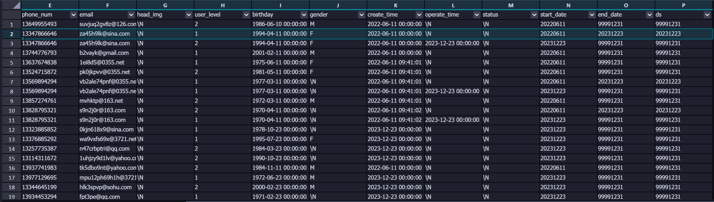

如果源 ODS 表是实时同步的话，会更麻烦些：

- 源表没有 ds 分区，只有 y, m, d，需要聚合操作一下。
- 头部会多出来几个字段，全选会有重复数据，多出来的几个字段需要过滤一下，所以有多包两个嵌套。

代码大概如下：

```SQL
SET odps.sql.hive.compatible = true
;

INSERT OVERWRITE TABLE dim_user_zip PARTITION (ds)
SELECT  id
        ,login_name
        ,nick_name
        ,name
        ,phone_num
        ,email
        ,head_img
        ,user_level
        ,birthday
        ,gender
        ,create_time
        ,operate_time
        ,status
        ,start_date
        ,IF(rn1 = 1,end_date,${ds}) end_date
        ,IF(rn1 = 1,end_date,${ds}) ds
FROM    (
            SELECT  id
                    ,login_name
                    ,nick_name
                    ,name
                    ,phone_num
                    ,email
                    ,head_img
                    ,user_level
                    ,birthday
                    ,gender
                    ,create_time
                    ,operate_time
                    ,status
                    ,start_date
                    ,end_date
                    ,ROW_NUMBER() OVER (PARTITION BY id ORDER BY start_date DESC ) rn1
            FROM    (
                        SELECT  id
                                ,login_name
                                ,nick_name
                                ,name
                                ,phone_num
                                ,email
                                ,head_img
                                ,user_level
                                ,birthday
                                ,gender
                                ,create_time
                                ,operate_time
                                ,status
                                ,start_date
                                ,end_date
                        FROM    dim_user_zip
                        WHERE   ds = '99991231'
                        UNION

(                        SELECT  id
                                ,login_name
                                ,nick_name
                                ,name
                                ,phone_num
                                ,email
                                ,head_img
                                ,user_level
                                ,birthday
                                ,gender
                                ,create_time
                                ,operate_time
                                ,status
                                ,start_date
                                ,end_date
                        FROM    (
                                    SELECT  id
                                            ,login_name
                                            ,nick_name
                                            ,name
                                            ,phone_num
                                            ,email
                                            ,head_img
                                            ,user_level
                                            ,birthday
                                            ,gender
                                            ,create_time
                                            ,operate_time
                                            ,`status`
                                            ,ROW_NUMBER() OVER (PARTITION BY id ORDER BY _execute_time_ DESC ) rn
                                            ,DATE_FORMAT(CONCAT(${y},'-',${m},'-',${d}),'yyyyMMdd') start_date
                                            ,'99991231' end_date
                                    FROM    ods_user_info_ri
                                    WHERE   year = ${y}
                                    AND     month = ${m}
                                    AND     day = ${d}
                                    AND     _after_image_ = 'Y'
                                ) t1
                        WHERE   rn = 1
)
                    ) t2
        ) t3
;
```


# 4. 修改表格属性

同 ODS 层：

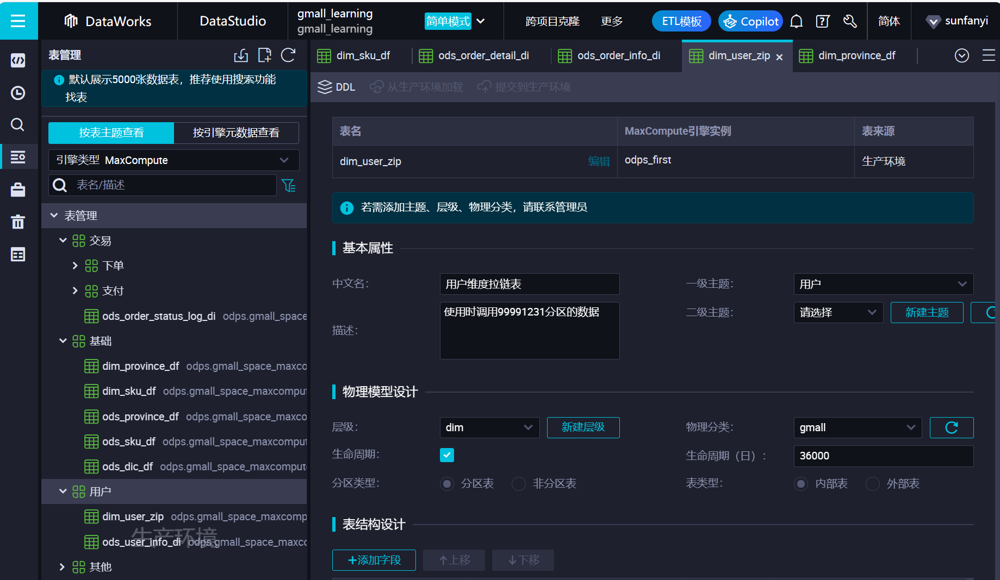


# 5. 关联业务表格

同 ODS 层：

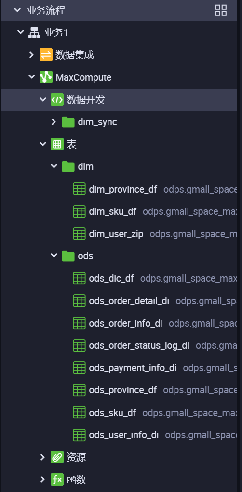