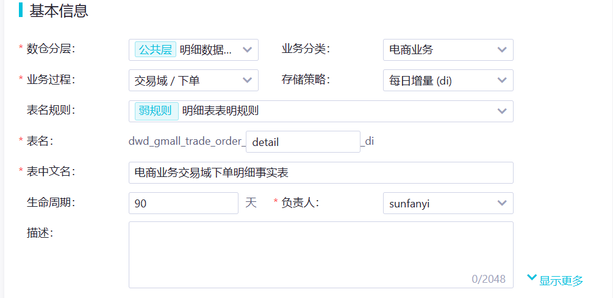

# 六. DWD 层搭建 <!-- omit from toc -->

- [1. 创建明细表](#1-创建明细表)
  - [1.1. 下单明细表](#11-下单明细表)
  - [1.2. 支付成功明细表](#12-支付成功明细表)
  - [1.3. 交易流程累计快照明细表](#13-交易流程累计快照明细表)
- [2. 同步明细表](#2-同步明细表)
  - [2.1. 下单明细表](#21-下单明细表)
    - [2.1.1. 首日装载](#211-首日装载)
    - [2.1.2. 每日装载](#212-每日装载)
  - [2.2. 交易成功明细表](#22-交易成功明细表)
    - [2.2.1. 首日装载](#221-首日装载)
    - [2.2.2. 每日装载](#222-每日装载)
  - [2.3. 交易流程累计快照明细表](#23-交易流程累计快照明细表)
    - [2.3.1. 首日装载](#231-首日装载)
    - [2.3.2. 每日装载](#232-每日装载)
- [3. 修改表格属性](#3-修改表格属性)
- [4. 关联业务表格](#4-关联业务表格)


# 1. 创建明细表

明细表即划分数据域，又划分业务过程。

## 1.1. 下单明细表

去维度建模新建明细表：



这个时候字段不能直接导入了，因为包含了两张表格数据（order_detail & order_info），要用到 JOIN，也可以先写个查询看看结构。这两张表区别在于前者会把每个订单里一次性买的不同商品分成几列，所以比后者更细一点，这里的表以 order_detail 的 id 为粒度：


## 1.2. 支付成功明细表


## 1.3. 交易流程累计快照明细表

用来记录订单的生命周期，即所有订单状态改变的时间（如下单、支付、发货。。。），所有历史记录都会存下来。


# 2. 同步明细表

这里三张表都是增量同步，跟以前一样，先初始化再设置每日同步。

## 2.1. 下单明细表

**dwd_gmall_trade_order_detail_di**


### 2.1.1. 首日装载

先用最老分区的数据初始化：

```SQL
SET odps.sql.hive.compatible = TRUE
;

INSERT OVERWRITE TABLE dwd_gmall_trade_order_detail_di PARTITION (ds)
SELECT  od.id
        ,order_id
        ,user_id
        ,sku_id
        ,province_id
        ,create_time
        ,sku_num
        ,split_original_amount
        ,split_activity_amount
        ,split_coupon_amount
        ,split_total_amount
        ,DATE_FORMAT(create_time,'yyyyMMdd') ds
FROM    (
            SELECT  id
                    ,order_id
                    ,sku_id
                    ,create_time
                    ,sku_num
                    ,order_price * sku_num AS split_original_amount
                    ,split_activity_amount
                    ,split_coupon_amount
                    ,split_total_amount
            FROM    ods_order_detail_di
            WHERE   ds = '20231222'
        ) od
LEFT JOIN   (
                SELECT  id
                        ,user_id
                        ,province_id
                FROM    ods_order_info_di
                WHERE   ds = '20231222'
            ) oi
ON      od.order_id = oi.id
;
```

> 这里直接用下单时间当了分区，其实也可以用业务实践，但这样的话就会有很多条数据集中在一天了，后期初始化的时候影响效果。

### 2.1.2. 每日装载

这里不同于之前那个会变动的维度表，此处的增量同步没那么麻烦，因为订单状态是不能改变的，只能新增。

所以 SQL 跟上面的初始化差不多，改个分区就行：

```SQL
SET odps.sql.hive.compatible = TRUE
;

INSERT OVERWRITE TABLE dwd_gmall_trade_order_detail_di PARTITION (ds)
SELECT  od.id
        ,order_id
        ,user_id
        ,sku_id
        ,province_id
        ,create_time
        ,sku_num
        ,split_original_amount
        ,split_activity_amount
        ,split_coupon_amount
        ,split_total_amount
        ,'${bizdate}' ds
FROM    (
            SELECT  id
                    ,order_id
                    ,sku_id
                    ,create_time
                    ,sku_num
                    ,order_price * sku_num AS split_original_amount
                    ,split_activity_amount
                    ,split_coupon_amount
                    ,split_total_amount 
            FROM    ods_order_detail_di
            WHERE   ds = '${bizdate}'
        ) od
LEFT JOIN   (
                SELECT  id
                        ,user_id
                        ,province_id
                FROM    ods_order_info_di
                WHERE   ds = '${bizdate}'
            ) oi
ON      od.order_id = oi.id
;

```


## 2.2. 交易成功明细表

整个支付流程：

1. 点击下单，payment_status 变成未支付，payment_info 表只要有 create_time 时间；
2. 用户支付，第三方给用户和店家同时发一个回执，payment_info 表出现 callback_time，也就是支付时间，同时 payment_status 变成已支付。


### 2.2.1. 首日装载

逻辑很简单，只是用到的表比上面多一点。

这里有两个过滤：
- `payment_status = '1602'`：已支付的订单；
- `parent_code = '11'`：代表的是“支付”这个类型里的 dic，加上这个会让 JOIN 快一点。

```SQL
SET odps.sql.hive.compatible = TRUE
;

INSERT OVERWRITE TABLE dwd_gmall_trade_payment_suc_detail_di PARTITION (ds)
SELECT  od.id
        ,od.order_id
        ,user_id
        ,sku_id
        ,province_id
        ,payment_type
        ,dic_name payment_name
        ,callback_time payment_time
        ,sku_num
        ,split_original_amount
        ,split_total_amount
        ,split_activity_amount
        ,split_coupon_amount
        ,DATE_FORMAT(callback_time,'yyyyMMdd') ds
FROM    (
            SELECT  order_id
                    ,user_id
                    ,payment_type
                    ,callback_time
            FROM    ods_payment_info_di
            WHERE   ds = '20231222'
            AND     payment_status = '1602'
        ) payment
JOIN    (
            SELECT  id
                    ,province_id
            FROM    ods_order_info_di
            WHERE   ds = '20231222'
            -- 1001 代表未支付，其他还有已支付、已发货。。
            -- 不加也行，这张表里其实都是已支付的
            AND     order_status != '1001'
        ) oi
ON      payment.order_id = oi.id
JOIN    (
            SELECT  id
                    ,order_id
                    ,sku_id
                    ,sku_num
                    ,order_price * sku_num split_original_amount
                    ,split_total_amount
                    ,split_activity_amount
                    ,split_coupon_amount
            FROM    ods_order_detail_di
            WHERE   ds = '20231222'
        ) od
ON      payment.order_id = od.order_id
LEFT JOIN   (
                SELECT  dic_code
                        ,dic_name
                FROM    ods_dic_df
                WHERE   ds = '20231222'
                AND     parent_code = '11'
            ) dic
ON      payment_type = dic_code
;

```
### 2.2.2. 每日装载

这里按理来说要追踪变更的，但源表没有实时同步，拿不到管理字段，比较麻烦，还没想好怎么写，就先不追踪了。

`ods_order_detail_di`表选的是全分区，因为有些数据支付日期在下单日期前，会有零点漂移的问题，干脆就够拿过来，反正用的是 INNER JOIN：

```SQL
SET odps.sql.hive.compatible = TRUE
;

INSERT OVERWRITE TABLE dwd_gmall_trade_payment_suc_detail_di PARTITION (ds)
SELECT  od.id
        ,od.order_id
        ,user_id
        ,sku_id
        ,province_id
        ,payment_type
        ,dic_name payment_name
        ,callback_time payment_time
        ,sku_num
        ,split_original_amount
        ,split_total_amount
        ,split_activity_amount
        ,split_coupon_amount
        ,DATE_FORMAT(callback_time,'yyyyMMdd') ds
FROM    (
            SELECT  order_id
                    ,user_id
                    ,payment_type
                    ,callback_time
            FROM    ods_payment_info_di
            WHERE   ds = '${bizdate}'
            AND     payment_status = '1602'
        ) payment
JOIN    (
            SELECT  id
                    ,province_id
            FROM    ods_order_info_di
            WHERE   ds = '${bizdate}' 
            AND     order_status != '1001' 
        ) oi
ON      payment.order_id = oi.id
JOIN    (
            SELECT  id
                    ,order_id
                    ,sku_id
                    ,sku_num
                    ,order_price * sku_num split_original_amount
                    ,split_total_amount
                    ,split_activity_amount
                    ,split_coupon_amount
            FROM    ods_order_detail_di
            WHERE   ds IS NOT NULL
        ) od
ON      payment.order_id = od.order_id
LEFT JOIN   (
                SELECT  dic_code
                        ,dic_name
                FROM    ods_dic_df
                WHERE   ds = '${bizdate}'
                AND     parent_code = '11'
            ) dic
ON      payment_type = dic_code
;

```

## 2.3. 交易流程累计快照明细表

### 2.3.1. 首日装载

如已完成，则是历史数据，即数据不会再发生修改，用完成时间当作分区，未完成的新数据分区为`99991231`：

```SQL
SET odps.sql.hive.compatible = TRUE
;

INSERT OVERWRITE TABLE dwd_gmall_trade_trade_flow_order_di PARTITION (ds)
SELECT  oi.order_id
        ,user_id
        ,province_id
        ,order_time
        ,payment_time
        ,delivery_time
        ,closed_time
        ,finished_time
        ,original_total_amount AS order_original_amount
        ,activity_reduce_amount AS order_activity_amount
        ,coupon_reduce_amount AS order_coupon_amount
        ,IF(payment_time IS NULL,0,total_amount) payment_amount
        ,IF(NVL(closed_time,finished_time) IS NOT NULL,DATE_FORMAT(NVL(closed_time,finished_time),'yyyyMMdd'),'99991231') ds
FROM    (
            SELECT  id order_id
                    ,user_id
                    ,province_id
                    ,create_time order_time
                    ,original_total_amount
                    ,activity_reduce_amount
                    ,coupon_reduce_amount
                    ,total_amount
            FROM    ods_order_info_di
            WHERE   ds = '20231222'
        ) oi
LEFT JOIN   (
                SELECT  order_id
                        ,create_time payment_time
                FROM    ods_order_status_log_di
                WHERE   ds = '20231222'
                AND     order_status = '1002' -- 已支付
            ) payment
ON      oi.order_id = payment.order_id
LEFT JOIN   (
                SELECT  order_id
                        ,create_time delivery_time
                FROM    ods_order_status_log_di
                WHERE   ds = '20231222'
                AND     order_status = '1004' -- 已发货
            ) delivery
ON      oi.order_id = delivery.order_id
LEFT JOIN   (
                SELECT  order_id
                        ,create_time closed_time
                FROM    ods_order_status_log_di
                WHERE   ds = '20231222'
                AND     order_status = '1005' -- 已关闭
            ) closed
ON      oi.order_id = closed.order_id
LEFT JOIN   (
                SELECT  order_id
                        ,create_time finished_time
                FROM    ods_order_status_log_di
                WHERE   ds = '20231222'
                AND     order_status = '1006' -- 已完成
            ) finished
ON      oi.order_id = finished.order_id
;
```

### 2.3.2. 每日装载

逻辑：要把新数据和之前`99991231`（还没有执行完的数据）拿出来一起 JOIN；其他跟首日装载差不多，就是主查询多了几个NVL：

```sql
SET odps.sql.hive.compatible = TRUE
;

-- 对于主查询里的前四个 NVL：如果payment表里昨天分区有数据，代表是新增的数据（这个时候oi表里是没有数据的，比如这个订单在昨天还没有支付），用payment表里的数据；否则用 oi 表里的历史数据
INSERT OVERWRITE TABLE dwd_gmall_trade_trade_flow_order_di PARTITION (ds)
SELECT  oi.order_id
        ,user_id
        ,province_id
        ,order_time
        ,NVL(payment.payment_time,oi.payment_time) AS payment_time
        ,NVL(delivery.delivery_time,oi.delivery_time) AS delivery_time
        ,NVL(closed.closed_time,oi.closed_time) AS closed_time
        ,NVL(finished.finished_time,oi.finished_time) AS finished_time
        ,order_original_amount
        ,order_activity_amount
        ,order_coupon_amount
        ,IF(NVL(payment.payment_time,oi.payment_time) IS NULL,0,oi.payment_amount) AS payment_amount  -- 用 NVL(payment.payment_time,oi.payment_time) 替换 payment_time（同一个主查询里不能向上面一样写别名，所以需要写长一点，下一行同理：
                                               
        -- ,IF(NVL(closed_time,finished_time) IS NOT NULL,DATE_FORMAT(NVL(closed_time,finished_time),'yyyyMMdd'),'99991231') ds
        ,IF(NVL(NVL(closed.closed_time,oi.closed_time),NVL(finished.finished_time,oi.finished_time)) IS NOT NULL,
           DATE_FORMAT(NVL(NVL(closed.closed_time,oi.closed_time),NVL(finished.finished_time,oi.finished_time)),'yyyyMMdd')
        ,'99991231') AS ds -- 如已完成，则是历史数据，未完成的新数据分区为99991231

FROM    (
            SELECT  order_id
                    ,user_id
                    ,province_id
                    ,order_time
                    ,payment_time
                    ,delivery_time
                    ,closed_time
                    ,finished_time
                    ,order_original_amount
                    ,order_activity_amount
                    ,order_coupon_amount
                    ,payment_amount
            FROM    dwd_gmall_trade_trade_flow_order_di
            WHERE   ds = '99991231'
            UNION
            SELECT  id order_id
                    ,user_id
                    ,province_id
                    ,create_time order_time
                    -- ODS 表没有这些字段，先补空值：
                    ,NULL AS payment_time
                    ,NULL AS delivery_time
                    ,NULL AS closed_time
                    ,NULL AS finished_time
                    ,original_total_amount AS order_original_amount
                    ,activity_reduce_amount AS order_activity_amount
                    ,coupon_reduce_amount AS order_coupon_amount
                    ,total_amount AS payment_amount
            FROM    ods_order_info_di
            WHERE   ds = '${bizdate}'
        ) oi
LEFT JOIN   (
                SELECT  order_id
                        ,create_time payment_time
                FROM    ods_order_status_log_di
                WHERE   ds = '${bizdate}'
                AND     order_status = '1002' -- 已支付
            ) payment
ON      oi.order_id = payment.order_id
LEFT JOIN   (
                SELECT  order_id
                        ,create_time delivery_time
                FROM    ods_order_status_log_di
                WHERE   ds = '${bizdate}'
                AND     order_status = '1004' -- 已发货
            ) delivery
ON      oi.order_id = delivery.order_id
LEFT JOIN   (
                SELECT  order_id
                        ,create_time closed_time
                FROM    ods_order_status_log_di
                WHERE   ds = '${bizdate}'
                AND     order_status = '1005' -- 已关闭
            ) closed
ON      oi.order_id = closed.order_id
LEFT JOIN   (
                SELECT  order_id
                        ,create_time finished_time
                FROM    ods_order_status_log_di
                WHERE   ds = '${bizdate}'
                AND     order_status = '1006' -- 已完成
            ) finished
ON      oi.order_id = finished.order_id
;

SELECT * FROM dwd_gmall_trade_trade_flow_order_di WHERE DS IS NOT NULL;
```

**结果**：

可以看到已完成的数据分区就固定住了，未完成的会一直保持在`99991231`，这里已完成的数据没有 payment_time，是因为随机造数据导致的，业务中不会出现。


# 3. 修改表格属性


# 4. 关联业务表格

