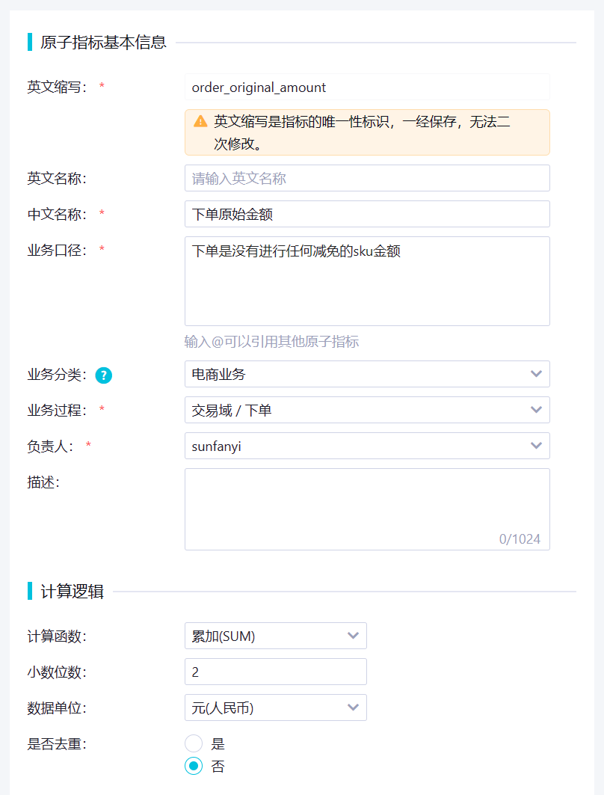
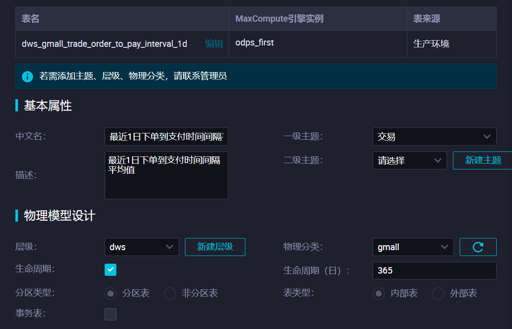

# 七. DWS 层搭建 <!-- omit from toc -->

- [1. 指标创建](#1-指标创建)
  - [1.1. 创建原子指标](#11-创建原子指标)
  - [1.2. 创建派生指标](#12-创建派生指标)
    - [1.2.1. 下单](#121-下单)
    - [1.2.2. 交易流程](#122-交易流程)
    - [1.2.3. 支付成功](#123-支付成功)
- [2. 创建汇总表](#2-创建汇总表)
  - [2.1. 用户粒度订单1日汇总表 dws\_gmall\_trade\_user\_order\_1d](#21-用户粒度订单1日汇总表-dws_gmall_trade_user_order_1d)
  - [2.2. 用户粒度支付1日汇总表 - dws\_gmall\_trade\_user\_payment\_1d](#22-用户粒度支付1日汇总表---dws_gmall_trade_user_payment_1d)
  - [2.3. 省份粒度订单1日汇总表 - dws\_gmall\_trade\_province\_order\_1d](#23-省份粒度订单1日汇总表---dws_gmall_trade_province_order_1d)
  - [2.4. 下单到支付时间间隔1日汇总表 - dws\_gmall\_trade\_order\_to\_pay\_interval\_1d](#24-下单到支付时间间隔1日汇总表---dws_gmall_trade_order_to_pay_interval_1d)
  - [2.5. 省份粒度订单n日汇总表 - dws\_gmall\_trade\_province\_order\_nd](#25-省份粒度订单n日汇总表---dws_gmall_trade_province_order_nd)
  - [2.6. 用户粒度订单至今汇总表 - dws\_gmall\_trade\_user\_order\_std](#26-用户粒度订单至今汇总表---dws_gmall_trade_user_order_std)
- [3. 同步汇总表](#3-同步汇总表)
  - [3.1. 用户粒度订单1日汇总表](#31-用户粒度订单1日汇总表)
    - [3.1.1. 首日装载](#311-首日装载)
    - [3.1.2. 每日装载](#312-每日装载)
  - [3.2. 用户粒度支付1日汇总表](#32-用户粒度支付1日汇总表)
    - [3.2.1. 首日装载](#321-首日装载)
    - [3.2.2. 每日装载](#322-每日装载)
  - [3.3. 省份粒度订单1日汇总表](#33-省份粒度订单1日汇总表)
    - [3.3.1. 首日装载](#331-首日装载)
    - [3.3.2. 每日装载](#332-每日装载)
  - [3.4. 下单到支付时间间隔1日汇总表](#34-下单到支付时间间隔1日汇总表)
    - [3.4.1. 首日装载](#341-首日装载)
    - [3.4.2. 每日装载](#342-每日装载)
  - [3.5. 省份粒度订单n日汇总表](#35-省份粒度订单n日汇总表)
  - [3.6. 用户粒度订单至今汇总表](#36-用户粒度订单至今汇总表)
    - [3.6.1. 首日装载](#361-首日装载)
    - [3.6.2. 每日装载](#362-每日装载)
- [4. 修改表格属性](#4-修改表格属性)
- [5. 关联业务表格](#5-关联业务表格)


# 1. 指标创建

## 1.1. 创建原子指标





## 1.2. 创建派生指标

可以手动一个一个创建，或者直接批量创建。

### 1.2.1. 下单


点击生成，创建并提交：


### 1.2.2. 交易流程


### 1.2.3. 支付成功


# 2. 创建汇总表

去维度建模新建汇总表：

## 2.1. 用户粒度订单1日汇总表 dws_gmall_trade_user_order_1d


**关联字段：**

或者看下一张表格用到的指标导入


保存 -> 提交 -> 发布。

## 2.2. 用户粒度支付1日汇总表 - dws_gmall_trade_user_payment_1d


**指标导入：**

相当于直接关联上了


然后去把user_id关联上：


## 2.3. 省份粒度订单1日汇总表 - dws_gmall_trade_province_order_1d


前五个手动添加：


## 2.4. 下单到支付时间间隔1日汇总表 - dws_gmall_trade_order_to_pay_interval_1d

不需要粒度，这张表是所有这一天内订单的时间间隔，只需要分区来表示时间就行：


## 2.5. 省份粒度订单n日汇总表 - dws_gmall_trade_province_order_nd


## 2.6. 用户粒度订单至今汇总表 - dws_gmall_trade_user_order_std


前三个手动加：


# 3. 同步汇总表

## 3.1. 用户粒度订单1日汇总表

### 3.1.1. 首日装载

把昨天以前的 groupby 分区就行：

```SQL
INSERT OVERWRITE TABLE dws_gmall_trade_user_order_1d PARTITION (ds)
SELECT  user_id
        ,COUNT(DISTINCT order_id) order_count_1d
        ,SUM(CAST(sku_num AS BIGINT)) order_sku_num_1d
        ,SUM(split_original_amount) order_original_amount_1d
        ,SUM(NVL(split_activity_amount,0)) activity_reduce_amount_1d
        ,SUM(NVL(split_coupon_amount,0)) coupon_reduce_amount_1d
        ,SUM(split_total_amount) order_total_amount_1d
        ,ds
FROM    dwd_gmall_trade_order_detail_di
WHERE   ds <= '20231222'
GROUP BY user_id
         ,ds
;
```

### 3.1.2. 每日装载

分区换一下就行：


```SQL
INSERT OVERWRITE TABLE dws_gmall_trade_user_order_1d PARTITION (ds)
SELECT  user_id
        ,COUNT(DISTINCT order_id) order_count_1d
        ,SUM(CAST(sku_num AS BIGINT)) order_sku_num_1d
        ,SUM(split_original_amount) order_original_amount_1d
        ,SUM(NVL(split_activity_amount,0)) activity_reduce_amount_1d
        ,SUM(NVL(split_coupon_amount,0)) coupon_reduce_amount_1d
        ,SUM(split_total_amount) order_total_amount_1d
        ,ds
FROM    dwd_gmall_trade_order_detail_di
WHERE   ds = '${bizdate}'
GROUP BY user_id
         ,ds
;
```

## 3.2. 用户粒度支付1日汇总表


跟上一张表一样很简单。

### 3.2.1. 首日装载

```SQL
INSERT OVERWRITE TABLE dws_gmall_trade_user_payment_1d PARTITION (ds)
SELECT  user_id
        ,SUM(CAST(sku_num AS BIGINT)) payment_suc_sku_num_1d
        ,COUNT(*) payment_suc_count_1d
        ,SUM(split_total_amount) payment_suc_amount_1d
        ,ds
FROM    dwd_gmall_trade_payment_suc_detail_di
WHERE   ds <= '20231222'
GROUP BY user_id
         ,ds
;
```

### 3.2.2. 每日装载

```SQL
INSERT OVERWRITE TABLE dws_gmall_trade_user_payment_1d PARTITION (ds)
SELECT  user_id
        ,SUM(CAST(sku_num AS BIGINT)) payment_suc_sku_num_1d
        ,COUNT(*) payment_suc_count_1d
        ,SUM(split_total_amount) payment_suc_amount_1d
        ,ds
FROM    dwd_gmall_trade_payment_suc_detail_di
WHERE   ds = '${bizdate}'
GROUP BY user_id
         ,ds
;
```


## 3.3. 省份粒度订单1日汇总表


### 3.3.1. 首日装载

```SQL
INSERT OVERWRITE TABLE dws_gmall_trade_province_order_1d PARTITION (ds)
SELECT  province_id
        ,name province_name
        ,area_code
        ,iso_code
        ,iso_3166_2
        ,activity_reduce_amount_1d
        ,order_count_1d
        ,coupon_reduce_amount_1d
        ,order_total_amount_1d
        ,order_user_num_1d
        ,order_original_amount_1d
        ,ds
FROM    (
            SELECT  province_id
                    ,SUM(split_activity_amount) activity_reduce_amount_1d
                    ,SUM(split_coupon_amount) coupon_reduce_amount_1d
                    ,SUM(split_total_amount) order_total_amount_1d
                    ,SUM(split_original_amount) order_original_amount_1d
                    ,COUNT(*) order_count_1d
                    ,COUNT(DISTINCT user_id) order_user_num_1d
                    ,ds
            FROM    dwd_gmall_trade_order_detail_di 
            WHERE   ds <= '20231222'
            GROUP BY province_id
                     ,ds
        ) t1
LEFT JOIN   (
                SELECT  id
                        ,name
                        ,area_code
                        ,iso_code
                        ,iso_3166_2
                FROM    dim_province_df 
                WHERE   ds = '20231222'
            ) province
ON      t1.province_id = province.id
;
```

### 3.3.2. 每日装载

```SQL
INSERT OVERWRITE TABLE dws_gmall_trade_province_order_1d PARTITION (ds)
SELECT  province_id
        ,name province_name
        ,area_code
        ,iso_code
        ,iso_3166_2
        ,activity_reduce_amount_1d
        ,order_count_1d
        ,coupon_reduce_amount_1d
        ,order_total_amount_1d
        ,order_user_num_1d
        ,order_original_amount_1d
        ,ds
FROM    (
            SELECT  province_id
                    ,SUM(split_activity_amount) activity_reduce_amount_1d
                    ,SUM(split_coupon_amount) coupon_reduce_amount_1d
                    ,SUM(split_total_amount) order_total_amount_1d
                    ,SUM(split_original_amount) order_original_amount_1d
                    ,COUNT(*) order_count_1d
                    ,COUNT(DISTINCT user_id) order_user_num_1d
                    ,ds
            FROM    dwd_gmall_trade_order_detail_di 
            WHERE   ds = '${bizdate}'
            GROUP BY province_id
                     ,ds
        ) t1
LEFT JOIN   (
                SELECT  id
                        ,name
                        ,area_code
                        ,iso_code
                        ,iso_3166_2
                FROM    dim_province_df 
                WHERE   ds = '${bizdate}'
            ) province
ON      t1.province_id = province.id
;
```


## 3.4. 下单到支付时间间隔1日汇总表

回忆一下源表（dwd_gmall_trade_trade_flow_order_di）长啥样：


### 3.4.1. 首日装载

选取未完成（未完成只已付款但订单还没结束）、或初始化日期前已完成的已付款订单：

```SQL
SET odps.sql.hive.compatible = true
;

INSERT OVERWRITE TABLE dws_gmall_trade_order_to_pay_interval_1d PARTITION (ds)
SELECT  CAST(AVG(UNIX_TIMESTAMP(payment_time,'yyyy-MM-dd HH:mm:ss') - UNIX_TIMESTAMP(order_time,'yyyy-MM-dd HH:mm:ss')) AS BIGINT)
        ,DATE_FORMAT(payment_time,'yyyyMMdd') ds
FROM    dwd_gmall_trade_trade_flow_order_di
WHERE   (
            ds = '99991231'  -- 未完成的
            OR      ds <= '20231222'
)
AND     payment_time IS NOT NULL -- 只要已付款的订单
GROUP BY DATE_FORMAT(payment_time,'yyyyMMdd')
;


```

### 3.4.2. 每日装载

选取未完成、bizdate刚完成的刚付款订单：

```SQL
SET odps.sql.hive.compatible = true
;

INSERT OVERWRITE TABLE dws_gmall_trade_order_to_pay_interval_1d PARTITION (ds)
SELECT  CAST(AVG(UNIX_TIMESTAMP(payment_time,'yyyy-MM-dd HH:mm:ss') - UNIX_TIMESTAMP(order_time,'yyyy-MM-dd HH:mm:ss')) AS BIGINT)
        ,DATE_FORMAT(payment_time,'yyyyMMdd') ds
FROM    dwd_gmall_trade_trade_flow_order_di
WHERE   (
            ds = '99991231'  -- 未完成的
            OR  ds = '${bizdate}'  -- bizdate刚完成的
)
AND     DATE_FORMAT(payment_time,'yyyyMMdd') = '${bizdate}'  -- 刚付款的
GROUP BY DATE_FORMAT(payment_time,'yyyyMMdd')
;

```


## 3.5. 省份粒度订单n日汇总表


n日表不需要首日装载，只要每天往前n天的数据。

需要对格式为`yyyyMMdd`的 ds 进行时间上的加减：
- 需要用到 `date_add` 函数。虽然这个函数支持 DATE、DATETIME 或 STRING 类型，但参数为 STRING 类型时，STRING参数格式至少要包含`yyyy-mm-dd`；
- 所以需要用 `date_format` 转换，但只支持 DATE 或 TIMESTAMP 类型；
- 这个时候需要转换成 DATE 或 TIMESTAMP 类型，这时候需要连用 `FROM_UNIXTIME(UNIX_TIMESTAMP())`，其中`UNIX_TIMESTAMP`会把 STRING 转换成表示时间的 UNIX 整数值，`FROM_UNIXTIME`会把它转换回时间;
- 加起来就是：
  
```SQL
DATE_ADD(DATE_FORMAT(FROM_UNIXTIME(UNIX_TIMESTAMP('20231222','yyyyMMdd')), 'yyyy-MM-dd'), -6)
```

-> 结果为 '2023-12-16'

最后再转化成`yyyyMMdd`：
  
```SQL
DATE_FORMAT(DATE_ADD(DATE_FORMAT(FROM_UNIXTIME(UNIX_TIMESTAMP('20231222','yyyyMMdd')), 'yyyy-MM-dd'), -6), 'yyyyMMdd')
```

以上为教材里的方法，其实ODPS提供更简单的函数，而且不用打开 hive，TO_DATE 将字符串转换成 datetime，输入为当前 string 的格式，TO_CHAR 将 datetime 转换回 string，输入为想要转换成为的形式：

```SQL
TO_CHAR(DATE_ADD(TO_DATE('20231222', 'yyyyMMdd'),-6),'yyyyMMdd')
```

SQL 如下：
```SQL
INSERT OVERWRITE TABLE dws_gmall_trade_province_order_nd PARTITION (ds)
SELECT  t1.province_id
        ,province_name
        ,area_code
        ,iso_code
        ,iso_3166_2
        ,order_count_1w
        ,order_user_num_1w
        ,coupon_reduce_amount_1w
        ,order_total_amount_1w
        ,order_sku_num_1w
        ,order_original_amount_1w
        ,activity_reduce_amount_1w
        ,order_user_num_1m
        ,coupon_reduce_amount_1m
        ,order_total_amount_1m
        ,order_sku_num_1m
        ,order_original_amount_1m
        ,activity_reduce_amount_1m
        ,order_count_1m
        ,'${bizdate}' AS ds
FROM    (
            SELECT  province_id
                    ,province_name
                    ,area_code
                    ,iso_code
                    ,iso_3166_2
                    ,SUM(
                        IF(ds >= TO_CHAR(DATE_ADD(TO_DATE('${bizdate}','yyyyMMdd'),-6),'yyyyMMdd'),order_count_1d,0)
                    ) order_count_1w
                    ,SUM(
                        IF(ds >= TO_CHAR(DATE_ADD(TO_DATE('${bizdate}','yyyyMMdd'),-6),'yyyyMMdd'),order_user_num_1d,0)
                    ) order_user_num_1w
                    ,SUM(
                        IF(ds >= TO_CHAR(DATE_ADD(TO_DATE('${bizdate}','yyyyMMdd'),-6),'yyyyMMdd'),coupon_reduce_amount_1d,0)
                    ) coupon_reduce_amount_1w
                    ,SUM(
                        IF(ds >= TO_CHAR(DATE_ADD(TO_DATE('${bizdate}','yyyyMMdd'),-6),'yyyyMMdd'),order_total_amount_1d,0)
                    ) order_total_amount_1w
                    ,SUM(
                        IF(ds >= TO_CHAR(DATE_ADD(TO_DATE('${bizdate}','yyyyMMdd'),-6),'yyyyMMdd'),order_original_amount_1d,0)
                    ) order_original_amount_1w
                    ,SUM(
                        IF(ds >= TO_CHAR(DATE_ADD(TO_DATE('${bizdate}','yyyyMMdd'),-6),'yyyyMMdd'),activity_reduce_amount_1d,0)
                    ) activity_reduce_amount_1w
                    ,SUM(order_user_num_1d) order_user_num_1m
                    ,SUM(coupon_reduce_amount_1d) coupon_reduce_amount_1m
                    ,SUM(order_total_amount_1d) order_total_amount_1m
                    ,SUM(order_original_amount_1d) order_original_amount_1m
                    ,SUM(activity_reduce_amount_1d) activity_reduce_amount_1m
                    ,SUM(order_count_1d) order_count_1m
            FROM    dws_gmall_trade_province_order_1d
            WHERE   ds BETWEEN TO_CHAR(DATE_ADD(TO_DATE('${bizdate}','yyyyMMdd'),-29),'yyyyMMdd') AND '${bizdate}'
            GROUP BY province_id
                     ,province_name
                     ,area_code
                     ,iso_code
                     ,iso_3166_2
        ) t1
JOIN    (
            SELECT  province_id
                    ,SUM(sku_num) order_sku_num_1w
            FROM    dwd_gmall_trade_order_detail_di
            WHERE   ds BETWEEN TO_CHAR(DATE_ADD(TO_DATE('${bizdate}','yyyyMMdd'),-6),'yyyyMMdd') AND '${bizdate}'
            GROUP BY province_id
        ) t2
ON      t1.province_id = t2.province_id
JOIN    (
            SELECT  province_id
                    ,SUM(sku_num) order_sku_num_1m
            FROM    dwd_gmall_trade_order_detail_di
            WHERE   ds BETWEEN TO_CHAR(DATE_ADD(TO_DATE('${bizdate}','yyyyMMdd'),-29),'yyyyMMdd') AND '${bizdate}'
            GROUP BY province_id
        ) t3
ON      t1.province_id = t3.province_id
;

```

## 3.6. 用户粒度订单至今汇总表


### 3.6.1. 首日装载

```SQL
INSERT OVERWRITE TABLE dws_gmall_trade_user_order_std PARTITION (ds = '20231222')
SELECT  user_id
        ,MIN(ds) AS order_date_first
        ,MAX(ds) AS order_date_last
        ,SUM(coupon_reduce_amount_1d) AS coupon_reduce_amount_std
        ,SUM(order_sku_num_1d) AS order_sku_num_std
        ,SUM(order_total_amount_1d) AS order_total_amount_std
        ,SUM(order_original_amount_1d) AS order_original_amount_std
        ,SUM(order_count_1d) AS order_count_std
        ,SUM(activity_reduce_amount_1d) AS activity_reduce_amount_std
FROM    dws_gmall_trade_user_order_1d
WHERE   ds <= '20231222'
GROUP BY user_id
;
```

### 3.6.2. 每日装载


```SQL
-- 每日的历史至今装载，只需要拿今天新的数据和上一次聚合的结果合并
INSERT OVERWRITE TABLE dws_gmall_trade_user_order_std PARTITION (ds = ${bizdate})
SELECT  COALESCE(o.user_id, n.user_id) as user_id
        ,COALESCE(o.order_date_first, n.ds) as order_date_first
        ,COALESCE(n.ds, o.order_date_last) as order_date_last
        ,COALESCE(o.coupon_reduce_amount_std, 0) + COALESCE(n.coupon_reduce_amount_1d, 0) as coupon_reduce_amount_std
        ,COALESCE(o.order_sku_num_std, 0) + COALESCE(n.order_sku_num_1d, 0) as order_sku_num_std
        ,COALESCE(o.order_total_amount_std, 0) + COALESCE(n.order_total_amount_1d, 0) as order_total_amount_std
        ,COALESCE(o.order_original_amount_std, 0) + COALESCE(n.order_original_amount_1d, 0) as order_original_amount_std
        ,COALESCE(o.order_count_std, 0) + COALESCE(n.order_count_1d, 0) as order_count_std
        ,COALESCE(o.activity_reduce_amount_std, 0) + COALESCE(n.activity_reduce_amount_1d, 0) as activity_reduce_amount_std
FROM    (
            SELECT  user_id
                    ,order_date_first
                    ,order_date_last
                    ,coupon_reduce_amount_std
                    ,order_sku_num_std
                    ,order_total_amount_std
                    ,order_original_amount_std
                    ,order_count_std
                    ,activity_reduce_amount_std
            FROM    dws_gmall_trade_user_order_std
            WHERE   ds = TO_CHAR(DATE_ADD(TO_DATE('${bizdate}','yyyyMMdd'),-1),'yyyyMMdd')
        ) o
FULL OUTER JOIN (
                    SELECT  user_id
                            ,order_count_1d
                            ,order_sku_num_1d
                            ,order_original_amount_1d
                            ,activity_reduce_amount_1d
                            ,coupon_reduce_amount_1d
                            ,order_total_amount_1d
                            ,ds
                    FROM    dws_gmall_trade_user_order_1d
                    WHERE   ds = '${bizdate}'
                ) n
ON      o.user_id = n.user_id
;
```


# 4. 修改表格属性





# 5. 关联业务表格

