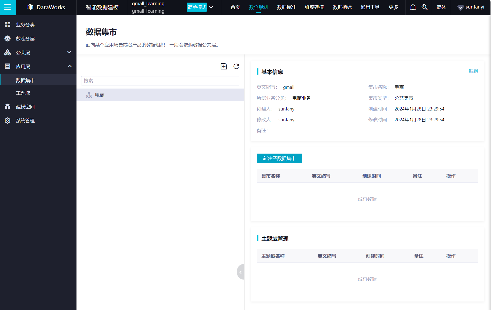
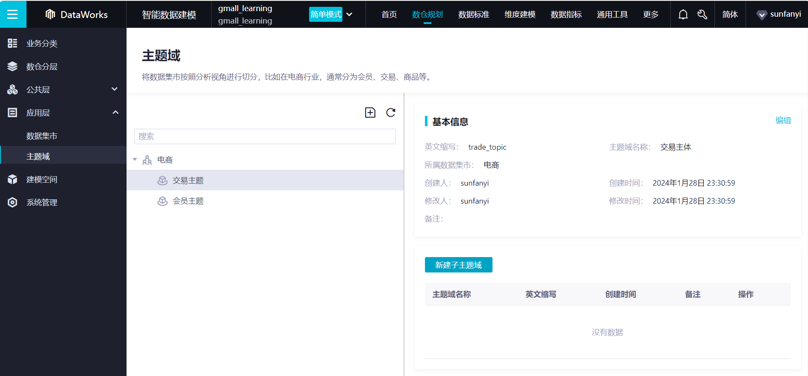
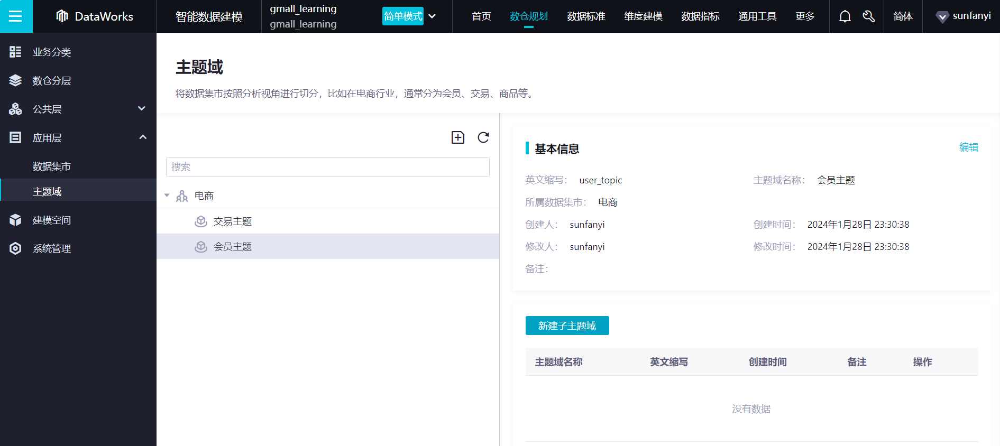
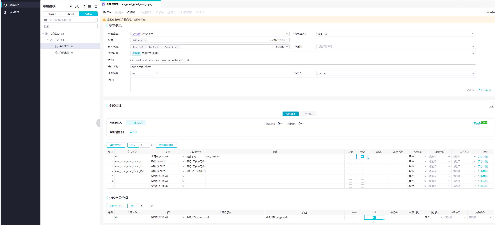
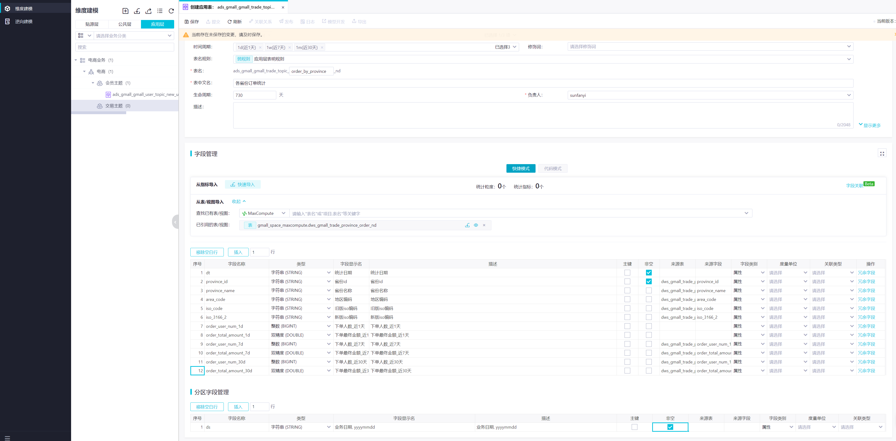
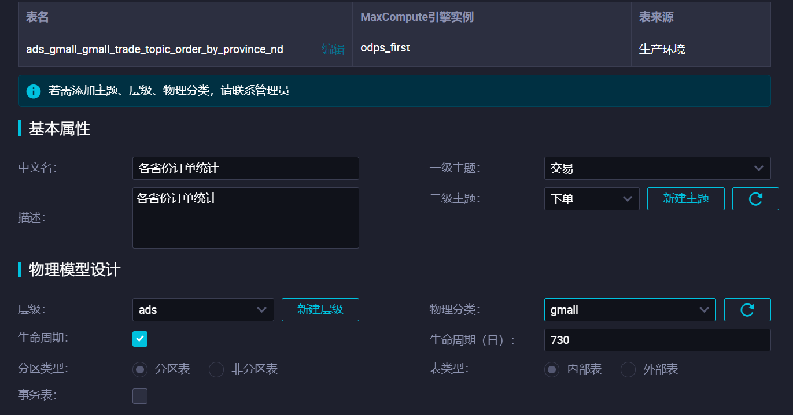
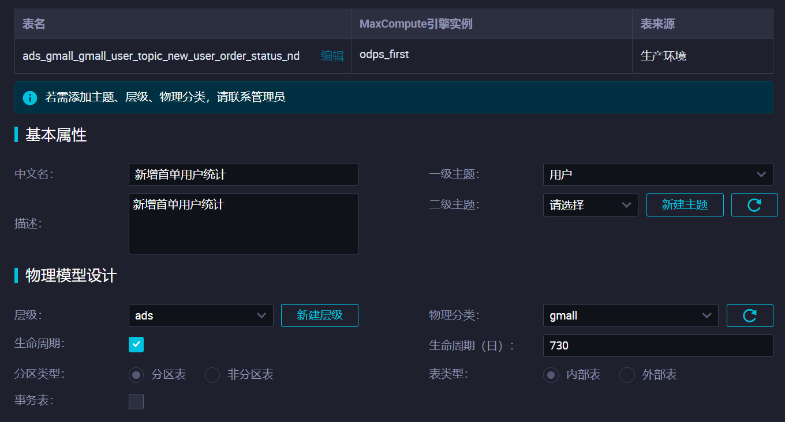
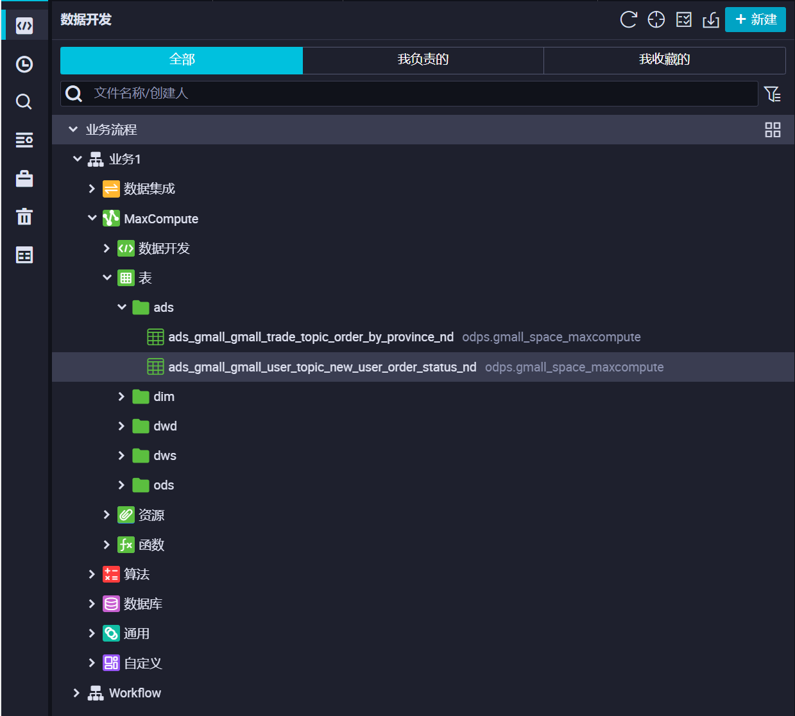

# 八. ADS 层搭建 <!-- omit from toc -->

- [1. 应用层建模](#1-应用层建模)
- [2. 创建应用层表](#2-创建应用层表)
- [3. 应用层表开发](#3-应用层表开发)
  - [3.1. 新增首单用户统计表](#31-新增首单用户统计表)
  - [3.2. 各省份订单统计表](#32-各省份订单统计表)
- [4. 修改表格属性](#4-修改表格属性)
- [5. 关联业务表格](#5-关联业务表格)

# 1. 应用层建模









# 2. 创建应用层表

**ads_user_topic_new_user_order_status_nd**

dt 是为了最后可视化展示的时候使用得到。



**ads_trade_topic_order_by_province_nd**



# 3. 应用层表开发

应用层表不需要首日装载，直接开发就行。

## 3.1. 新增首单用户统计表

ads_user_topic_new_user_order_status_nd

首次订单在时间范围内就是首单用户：

```SQL
INSERT OVERWRITE TABLE ads_gmall_gmall_user_topic_new_user_order_status_nd PARTITION (ds = ${bizdate})
SELECT  TO_CHAR(TO_DATE('${bizdate}','yyyyMMdd'),'yyyy-MM-dd') AS dt
        ,SUM(IF(order_date_first = '${bizdate}',1,0)) AS new_order_user_count_7d
        ,SUM(
            IF(order_date_first >= TO_CHAR(DATE_ADD(TO_DATE('${bizdate}','yyyyMMdd'),-6),'yyyyMMdd'),1,0)
        ) AS new_order_user_count_7d
        ,SUM(
            IF(order_date_first >= TO_CHAR(DATE_ADD(TO_DATE('${bizdate}','yyyyMMdd'),-29),'yyyyMMdd'),1,0)
        ) AS new_order_user_count_30d
FROM    dws_gmall_trade_user_order_std
WHERE   ds = '${bizdate}'
;

```
## 3.2. 各省份订单统计表

ads_trade_topic_order_by_province_nd

```SQL
INSERT OVERWRITE TABLE ads_gmall_gmall_trade_topic_order_by_province_nd PARTITION (ds = ${bizdate})
SELECT  TO_CHAR(TO_DATE('${bizdate}','yyyyMMdd'),'yyyy-MM-dd') AS dt
        ,nd.province_id
        ,nd.province_name
        ,nd.area_code
        ,nd.iso_code
        ,nd.iso_3166_2
        ,od.order_user_num_1d
        ,CAST(od.order_total_amount_1d AS DOUBLE)
        ,nd.order_user_num_1w
        ,CAST(nd.order_total_amount_1w AS DOUBLE)
        ,nd.order_user_num_1m
        ,CAST(nd.order_total_amount_1m AS DOUBLE)
FROM    dws_gmall_trade_province_order_nd nd
LEFT JOIN dws_gmall_trade_province_order_1d od
ON      od.province_id = nd.province_id
WHERE   od.ds = '${bizdate}'
AND     nd.ds = '${bizdate}'
;
```


# 4. 修改表格属性





# 5. 关联业务表格

