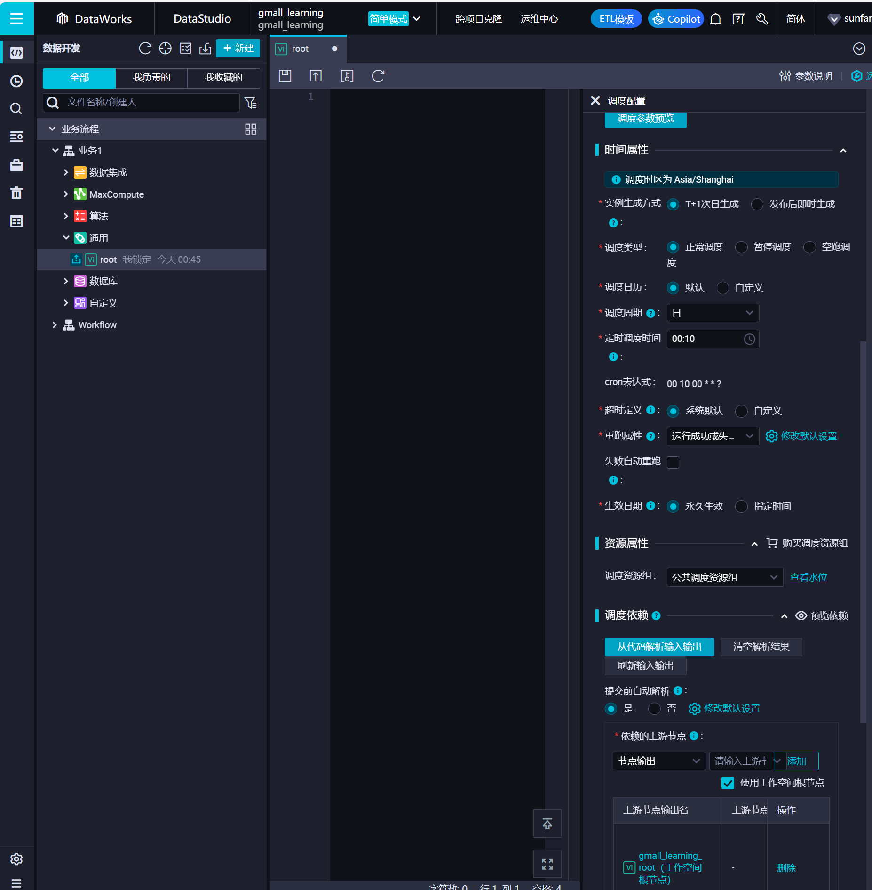
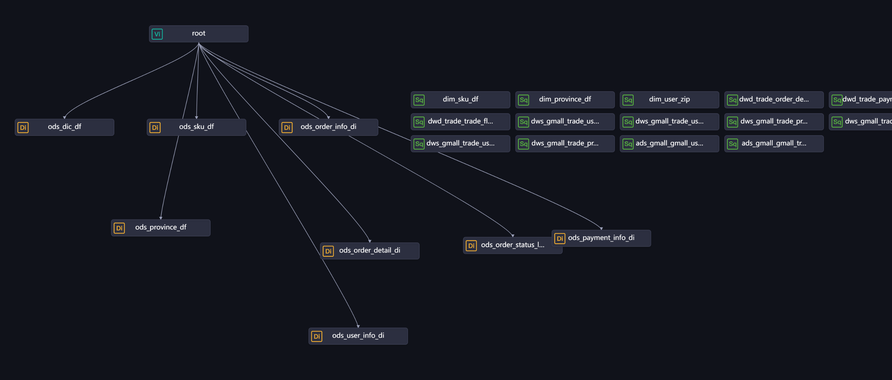
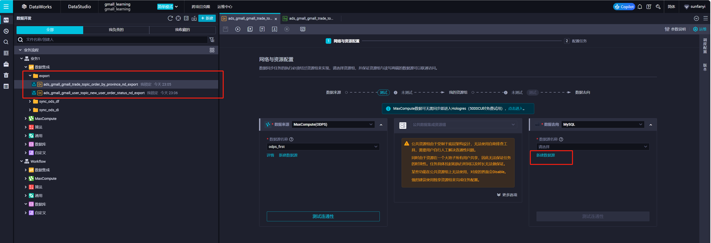

# 九. 作业调度与数据导出 <!-- omit from toc -->

- [1. 作业调度](#1-作业调度)
  - [1.1. 创建根节点](#11-创建根节点)
  - [1.2. 调度配置](#12-调度配置)
  - [1.3. 结果](#13-结果)
  - [1.4. 业务流程模拟](#14-业务流程模拟)
- [2. 数据导出](#2-数据导出)
  - [2.1. RDS 表格创建](#21-rds-表格创建)
  - [2.2. 数据同步](#22-数据同步)


# 1. 作业调度

- 通俗的讲就是设置一个时间让它自己跑，比如按天的周期调度，各节点就会在每天的某个时间点自动更新表格；
- 调度需要设置上下游依赖，这样才能让数仓中的表按顺序一个一个更新，比如 ods -> dwd -> ads；
- 同时仅当所有上游表更新完成，下游表才能执行调度任务；
- 双击业务流程，可以看到目前所有节点都没有上下游依赖：


## 1.1. 创建根节点

先为业务流程创建一个根节点，这样之后可以通过冻结根节点的方式快速暂停下游的所有调度任务：



## 1.2. 调度配置

- 先要添加上下游依赖，两种方法都可以：

方法一：
- 可以直接在这里面连线，表的上游一般选更新这张表需要用到哪些表的数据，ods层则用项目根节点；
- 不推荐这种方法，下面dws或者ads层就开始乱了；
- 一般的做法是在之前开发的时候就顺便把上游跟调度属性填好，见方法二。



方法二：
- 去具体的节点右边的调度配置，把该填的都填了；
- 保存 -> 体检
- 如果做了生产开发环境隔离的话，还需要做一步发布；
- ods 举例：


- ods层下面的层就不能只依赖根节点，而是具体的表了；
- 一般来说添加上游依赖可以直接点从代码解析，很方便；
- 但这个教程里，maxcompute 引擎和工作空间的命名不一样（一般命名成一样就会很方便），这样会导致直接解析会：


- 只能手动搜索了；
- 解析的原理是直接把带工作空间的完整表名当成输出上游节点输出名；
- 而当前节点的输出名，则默认是当前文件名的带工作空间的完整名字；
- 这也就是为什么，节点的文件名最好跟表格名一样，这样配置上下游依赖的时候会很方便；
- 如果不一样的话，建议确认一下输出表名，这样之后下游的表再配置上游依赖的时候也可以通过表名搜索（红框内）：


- 实际工作中，有些人没点“从代码解析”，这时输出表名就会为空，即只会输出一个“输出节点名”。
- 一般是没关系的，但如果恰好开发者设置的文件名（节点名）也不是表名，而下游的表格使用者只知道这个表格的名字，他们就没有办法找到这张表的上游输出节点（特别是跨工作空间读表的时候，根本找不到），也就没法配置依赖；
- 这个时候就只能通过“数据地图”里表格信息的“产出任务”，查看节点输出名，或者节点ID，从而搜到节点。

## 1.3. 结果


## 1.4. 业务流程模拟

**模拟补数据操作：**
- 用```application.yml```脚本，造新一天数据，这里用20240217举例；
- 造好数据后，可以直接在上图右键根节点，选择运行节点及下游；
- 下游的节点会自动运行，但这种无法指定bizdate，如果常规业务流程中补数据，可以去数据运维，选择bizdate运行，并且可以同时选择多个bizdate并行计算：


> 之后就不需要手动补了，按照调度配置里选择的调度周期，会自动定时跑。


# 2. 数据导出

## 2.1. RDS 表格创建

去 MySQL 里新建数据库：


建2张和ADS层结果一样的表，DDL statement 可以直接去阿里云的维度建模中的代码模式里获取（注意ds不要），和ODPS的DDL语句不同之处在于：
- 数据类型不通用（string -> varchar(64))
- RDS 没有分区
- 没有项目空间概念，但要指定数据库
- 没有生命周期概念


```SQL
CREATE TABLE gmall_adb.ads_gmall_gmall_user_topic_new_user_order_status_nd
(
   dt                       VARCHAR(128) NOT NULL COMMENT 'yyyy-MM-dd',
   new_order_user_count_1d  BIGINT COMMENT '最近1天首单用户',
   new_order_user_count_7d  BIGINT COMMENT '最近7天首单用户',
   new_order_user_count_30d BIGINT COMMENT '最近30天首单用户',
) COMMENT '新增首单用户统计';

CREATE TABLE gmall_adb.ads_gmall_gmall_trade_topic_order_by_province_nd
(
   dt                     VARCHAR(128) NOT NULL COMMENT '统计日期',
   province_id            VARCHAR(128) NOT NULL COMMENT '省份id',
   province_name          VARCHAR(128) COMMENT '省份名称',
   area_code              VARCHAR(128) COMMENT '地区编码',
   iso_code               VARCHAR(128) COMMENT '旧版iso编码',
   iso_3166_2             VARCHAR(128) COMMENT '新版iso编码',
   order_user_num_1d      BIGINT COMMENT '下单人数_近1天',
   order_total_amount_1d  DOUBLE COMMENT '下单最终金额_近1天',
   order_user_num_7d      BIGINT COMMENT '下单人数_近7天',
   order_total_amount_7d  DOUBLE COMMENT '下单最终金额_近7天',
   order_user_num_30d     BIGINT COMMENT '下单人数_近30天',
   order_total_amount_30d DOUBLE COMMENT '下单最终金额_近30天',
) COMMENT '各省份订单统计';
```

设置一下主键：


## 2.2. 数据同步

去 DataStudio 里新建离线节点，注意需要新建数据源：




添加调度配置，上下游，手动补数据，done。

